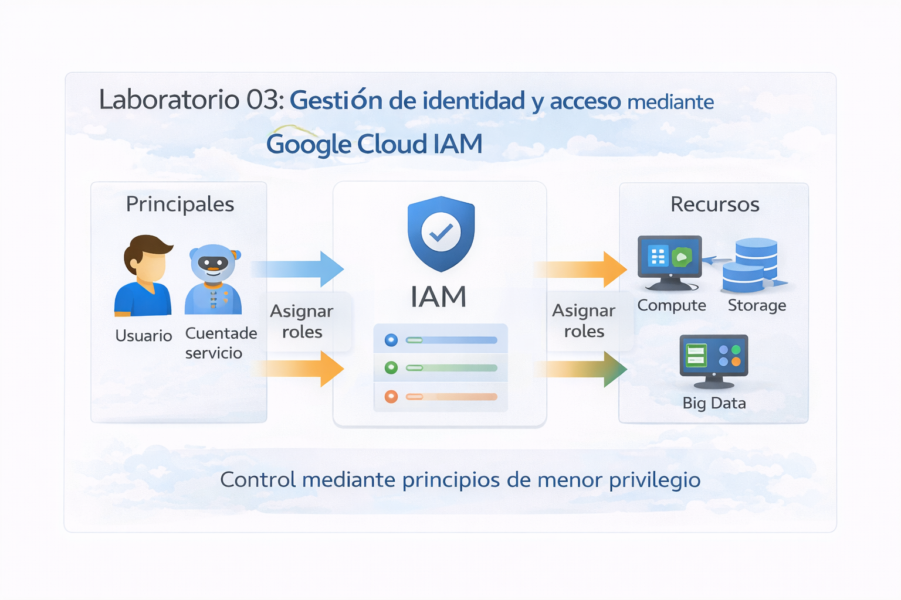

# Laboratorio 03: Innovar con Inteligencia Artificial en Google Cloud

## Objetivo de la práctica
Al finalizar la práctica, serás capaz de:
- Identificar los servicios de Inteligencia Artificial disponibles en Google Cloud.
- Utilizar una API de IA preentrenada sin necesidad de conocimientos avanzados.
- Comprender la diferencia entre IA preentrenada y modelos personalizados.
- Analizar cómo la IA impulsa la innovación empresarial.

---

## Objetivo visual
Representar el flujo de interacción entre un usuario, un prompt y un modelo de IA administrado en Vertex AI.



---

## Duración aproximada **40 minutos**.

---

## Tabla de ayuda

| Elemento | Descripción |
|--------|------------|
| Plataforma | Google Cloud Platform |
| Navegador | Google Chrome (recomendado) |
| Servicios principales | Vertex AI |
| Tipo de IA | IA preentrenada |
| Proyecto | Proyecto activo de Google Cloud |

---

## Instrucciones

### Tarea 1. Acceder a los servicios de IA en Google Cloud

Paso 1. Acceder a https://console.cloud.google.com.  

Paso 2. Verificar que exista un **proyecto activo** en la parte superior de la consola.  

Paso 3. En la barra de búsqueda, escribir **Vertex AI** y seleccionarlo.
### Paso adicional. Habilitar Vertex AI por primera vez

Al acceder por primera vez a Vertex AI Studio, puede aparecer una ventana emergente solicitando habilitar las APIs necesarias.

Paso 4. Revisar el mensaje **Get started with Vertex AI Studio**.

Paso 5. Verificar que se muestre lo siguiente:
- **Vertex AI API**: Not enabled
- **Cloud Storage**: Enabled

Paso 6. Hacer clic en el botón **Agree & continue** para habilitar automáticamente las APIs requeridas.


> Nota: No se realiza ningún cargo por habilitar estas APIs. Solo se cobrará si posteriormente se utilizan recursos de pago.

Paso 7. Esperar unos segundos a que finalice la habilitación y continúe la carga de Vertex AI Studio.

---
#### ¿Sabías que…?
**Concepto: ¿Qué es Vertex AI?**

Vertex AI es la plataforma unificada de Google Cloud para crear, entrenar, desplegar y consumir modelos de Inteligencia Artificial, incluyendo modelos preentrenados y personalizados.

#### ¿Sabías que…?
**Concepto: Habilitación de APIs en Google Cloud**

En Google Cloud, muchos servicios requieren que sus **APIs estén habilitadas explícitamente** antes de poder usarse.  
Esto permite:
- Mayor control de seguridad  
- Administración de costos  
- Activación bajo demanda de servicios  

Vertex AI necesita habilitar:
- **Vertex AI API** para ejecutar modelos de IA  
- **Cloud Storage** para almacenar datos y resultados

---

### Tarea 2. Explorar Vertex AI Studio y sus capacidades

En esta tarea identificarás las diferentes capacidades de IA disponibles en Vertex AI Studio.

Paso 1. Confirmar que te encuentras en la pantalla principal de **Vertex AI Studio**.

Debes observar:
- El título **Vertex AI Studio**
- Un botón **New** en el panel izquierdo

Paso 2. Hacer clic en el botón **New**.

Se desplegarán varias opciones de creación:

- **Chat**
- **Image**
- **Video**
- **Music**
- **Speech**
- **Live API**
- **Build (preview)**

---

#### ¿Sabías que…?
**Concepto: Capacidades de IA en Vertex AI**

Cada opción representa un tipo distinto de Inteligencia Artificial:

- **Chat**: Texto → Texto (IA conversacional)
- **Image**: Texto → Imagen
- **Video**: Texto → Video
- **Music**: Generación de música
- **Speech**: Texto ↔ Voz
- **Live API**: Integración con aplicaciones
- **Build**: Creación de aplicaciones con IA

Vertex AI centraliza todas estas capacidades en una sola plataforma.

---

### Tarea 3. Crear tu primer prompt con IA (Chat)

En esta tarea usarás un modelo de lenguaje para interactuar con IA mediante texto.

Paso 1. En el menú **New**, seleccionar la opción **Chat**.

Paso 2. Verificar que se abra un nuevo espacio de trabajo con:
- Un editor de prompt
- Un panel de configuración del modelo a la derecha

Paso 3. En el panel derecho, ubicar la sección **Model settings**.

Paso 4. Confirmar que el modelo seleccionado sea **Gemini**  
(por ejemplo: `gemini-3-pro-preview` o el disponible).

Paso 5. Ubicar el campo inferior que dice:

> *Write a prompt, or use /commands*

Paso 6. Escribir el siguiente prompt de ejemplo:

```text
Explícame qué es la Inteligencia Artificial en términos simples y dame un ejemplo de uso en una empresa.
```
Paso 7. Presionar Enter o el botón de enviar.

**Resultado esperado**:
El modelo responderá con una explicación clara sobre qué es la IA y un ejemplo práctico de uso empresarial.

¿Sabías que…?

Un prompt es la instrucción que se le da a un modelo de IA.
La calidad del prompt influye directamente en la calidad de la respuesta.

---

### Tarea 4. Comprender y seleccionar modelos de IA en Vertex AI Studio

En esta tarea aprenderás a identificar los diferentes modelos disponibles en Vertex AI Studio y cuándo utilizar cada uno.

Paso 1. En Vertex AI Studio, ubicar el panel **Model settings** del lado derecho.

Paso 2. Hacer clic en el selector de modelo para visualizar la lista de modelos disponibles.

Paso 3. Identificar las siguientes categorías:
- **Latest**: modelos más recientes recomendados por Google.
- **Gemini**: modelos de lenguaje multimodales (texto, razonamiento, código).
- **Third-party**: modelos externos integrados.
- **Tuned**: modelos personalizados.

Paso 4. Ubicar los modelos:
- **gemini-3-flash-preview**
- **gemini-3-pro-preview**
- **Nano Banana Pro**

---

#### ¿Sabías que…?
**Concepto: Selección de modelos de IA**

Cada modelo de IA está optimizado para distintos objetivos:
- **Velocidad**
- **Calidad de respuesta**
- **Generación de texto**
- **Generación de imágenes**
- **Razonamiento complejo**

Elegir el modelo correcto mejora resultados y controla costos.

---

#### Modelo: Gemini 3 Flash

- Optimizado para **respuestas rápidas**
- Ideal para chat y pruebas rápidas
- Menor latencia

**Caso de uso típico:** asistentes conversacionales y prototipos.

---

#### Modelo: Gemini 3 Pro

- Optimizado para **mayor calidad y razonamiento**
- Mejor comprensión de instrucciones complejas

**Caso de uso típico:** análisis, educación, generación de contenido detallado.

---

#### Modelo: Nano Banana Pro

- Modelo especializado en **generación de imágenes**
- Ideal para diagramas, ilustraciones y texto dentro de imágenes

**Casos de uso:**
- Diagramas explicativos
- Imágenes educativas
- Contenido visual para presentaciones

---

#### ¿Sabías que…?
**Concepto: Knowledge Cutoff**

El *knowledge cutoff* indica hasta qué fecha el modelo fue entrenado.
Por ejemplo, Nano Banana Pro tiene conocimiento hasta **enero de 2025**.

---

Paso 5 . Seleccionar **Nano Banana Pro** y generar una imagen con el siguiente prompt:

```text
Cree un diagrama que explique cómo la inteligencia artificial ayuda a una empresa a tomar decisiones.
```
Paso 6. Presionar Enter o el botón de ejecutar para generar la imagen.

Paso 7. Analizar la imagen generada por el modelo.

Observa que el modelo:
- Interpreta el concepto de toma de decisiones empresariales.
- Genera un diagrama visual coherente.
- Integra texto y elementos gráficos de forma automática.

---

**Resultado esperado**  
Se generará una imagen que represente visualmente cómo la Inteligencia Artificial apoya la toma de decisiones en una empresa, utilizando datos, análisis y resultados como elementos clave.

---

#### ¿Sabías que…?
**Concepto: Modelos multimodales**

Un modelo multimodal es aquel capaz de trabajar con más de un tipo de información, por ejemplo:
- Texto
- Imágenes
- Audio
- Video

Vertex AI permite trabajar con modelos multimodales desde una sola plataforma, facilitando el desarrollo de soluciones avanzadas de IA.

---

### Tarea 5. Relación entre IA preentrenada y casos de negocio

En esta tarea reflexionarás sobre cómo la IA preentrenada puede ser utilizada en escenarios reales.

Paso 1. Identificar que los modelos utilizados en este laboratorio son **modelos preentrenados**.

Paso 2. Analizar las siguientes ventajas de la IA preentrenada:
- No requiere entrenamiento desde cero.
- Reduce tiempos de implementación.
- Disminuye costos iniciales.
- Permite obtener valor inmediato.

Paso 3. Relacionar los modelos vistos con posibles casos de uso empresariales:

| Modelo | Caso de uso |
|------|------------|
| Gemini 3 Flash | Chatbots de atención al cliente |
| Gemini 3 Pro | Análisis de información y generación de reportes |
| Nano Banana Pro | Diagramas, contenido visual, material educativo |

---

#### ¿Sabías que…?
**Concepto: IA preentrenada vs IA personalizada**

- **IA preentrenada**: lista para usarse, ideal para prototipos y soluciones rápidas.
- **IA personalizada**: entrenada con datos propios, ideal para necesidades muy específicas.

Vertex AI permite usar ambos enfoques dentro de la misma plataforma.

---

## Conclusiones

En este laboratorio aprendiste que:

- Google Cloud ofrece una plataforma integral para trabajar con Inteligencia Artificial mediante Vertex AI.
- Vertex AI Studio permite interactuar con modelos de IA sin necesidad de programar.
- Existen diferentes modelos optimizados para distintos objetivos, como texto, imágenes y razonamiento.
- La correcta selección del modelo impacta directamente en la calidad de los resultados y en los costos.
- La IA preentrenada permite a las empresas innovar rápidamente sin una inversión inicial elevada.

La Inteligencia Artificial no solo es una tecnología avanzada, sino una herramienta estratégica que impulsa la innovación, optimiza procesos y mejora la toma de decisiones en las organizaciones.

---
### Fin del laboratorio 3
