# Laboratorio 04: Almacenamiento en la nube con Google Cloud Storage

## Objetivo de la práctica
Al finalizar la práctica, serás capaz de:
- Identificar el rol del almacenamiento en la nube dentro de una arquitectura digital.
- Crear y administrar un bucket en Google Cloud Storage.
- Cargar y gestionar archivos en la nube.
- Comprender los casos de uso del almacenamiento de objetos.
- Analizar cómo Cloud Storage habilita soluciones escalables y seguras.

---

## Objetivo visual
Representar el flujo de almacenamiento de archivos desde un usuario hacia un bucket en Google Cloud Storage.

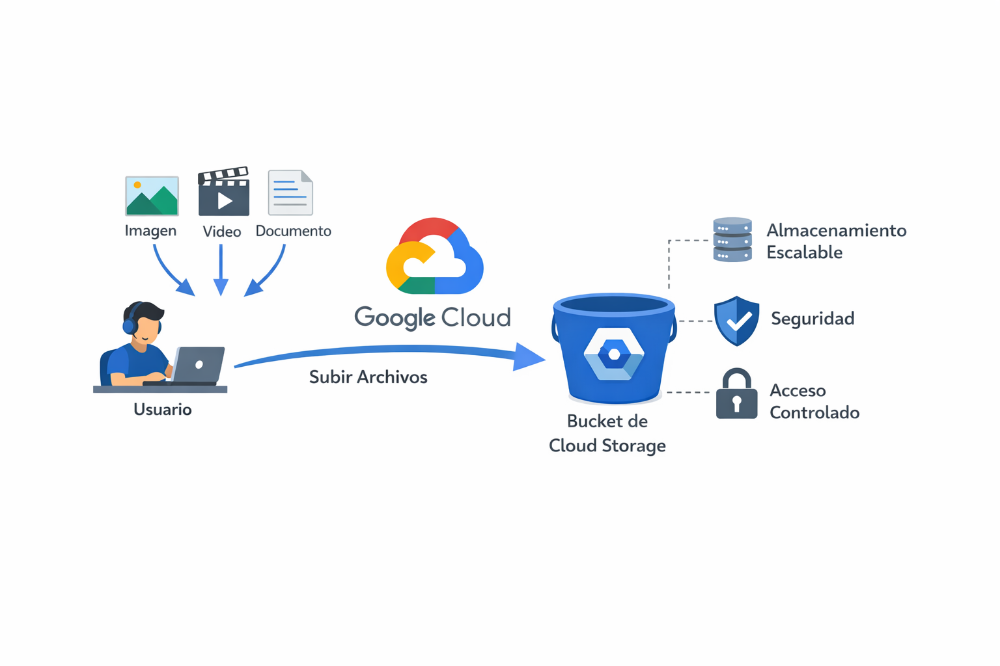

---

## Duración aproximada **40 minutos**

---

## Tabla de ayuda

| Elemento | Descripción |
|--------|------------|
| Plataforma | Google Cloud Platform |
| Navegador | Google Chrome (recomendado) |
| Servicio principal | Cloud Storage |
| Tipo de almacenamiento | Object Storage |
| Proyecto | Proyecto activo de Google Cloud |

---

## Instrucciones

---

### Tarea 1. Comprender el almacenamiento en la nube

Antes de crear recursos, es importante entender el concepto clave de este módulo.

#### ¿Sabías que…?
**Concepto: ¿Qué es Cloud Storage?**

Cloud Storage es un servicio de **almacenamiento de objetos** altamente escalable y duradero.  
Permite almacenar archivos como:
- Imágenes
- Videos
- Documentos
- Archivos de respaldo
- Datos para aplicaciones y analítica

Los archivos se almacenan como **objetos** dentro de contenedores llamados **buckets**.

---

### Tarea 2. Acceder a Google Cloud Storage

Paso 1. Acceder a https://console.cloud.google.com.  

Paso 2. Verificar que exista un **proyecto activo** en la parte superior de la consola.  

Paso 3. En la barra de búsqueda, escribir **Cloud Storage** y seleccionar **Buckets**.

---

### Tarea 3. Crear un bucket en Cloud Storage

En esta tarea crearás tu primer bucket de almacenamiento.

Paso 1. En la pantalla de **Buckets**, hacer clic en el botón **Create**.

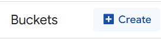

Paso 2. Configurar el bucket con los siguientes valores:

| Configuración | Acción |
|--------------|--------|
| Nombre del bucket | Nombre único (ej. `datos-lab-storage-tu-nombre`) |
| Ubicación | **US (multirregión)** |
| Clase de almacenamiento | **Standard** |
| Control de acceso | Uniform |
| Protección de datos | Dejar valores por defecto |

Paso 3. Hacer clic en **Create**.

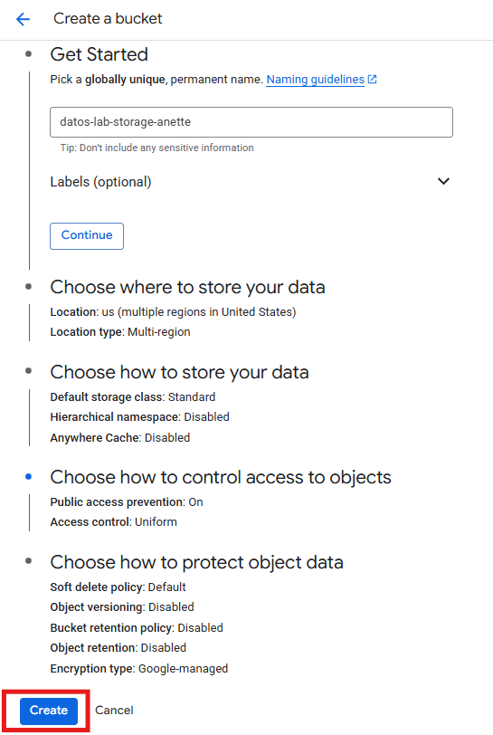
---

#### ¿Sabías que…?
**Concepto: Nombre único de bucket**

Los nombres de los buckets deben ser **únicos a nivel global**, ya que Cloud Storage es un servicio global.

---

#### ¿Sabías que…?
**Concepto: Clases de almacenamiento**

Cloud Storage ofrece distintas clases según la frecuencia de acceso:
- **Standard**: acceso frecuente
- **Nearline**: acceso ocasional
- **Coldline**: acceso poco frecuente
- **Archive**: archivado a largo plazo

En este laboratorio se utiliza **Standard**.

---

### Tarea 4. Cargar archivos al bucket

En esta tarea subirás archivos al bucket creado.

Paso 1. Hacer clic en el nombre del bucket recién creado.

Paso 2. Seleccionar la pestaña **Objects**.

Paso 3. Hacer clic en **Upload files**.

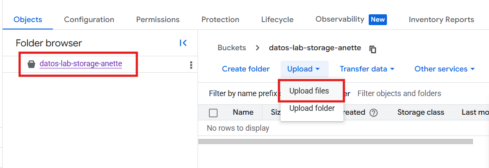

Paso 4. Seleccionar uno o más archivos desde tu equipo local (imagen o documento PDF).

Paso 5. Esperar a que finalice la carga.

---

#### ¿Sabías que…?
**Concepto: Objeto en Cloud Storage**

Un objeto es cualquier archivo almacenado en un bucket.  
Cada objeto tiene:
- Nombre
- Tamaño
- Tipo
- Metadatos
- Permisos

---

### Tarea 5. Administrar objetos almacenados

En esta tarea explorarás las acciones disponibles sobre los archivos.

Paso 1. Seleccionar un objeto dentro del bucket.

Paso 2. Revisar las opciones disponibles:
- Descargar
- Editar metadata
- Editar acceso
- Eliminar

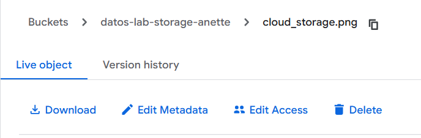

---
### Tarea 6. Configurar control de acceso con mínimo privilegio en Cloud Storage

En esta tarea configurarás y comprobarás el acceso a un bucket aplicando el principio de **mínimo privilegio** mediante IAM.

Valida que estes en Detalles del bucket 
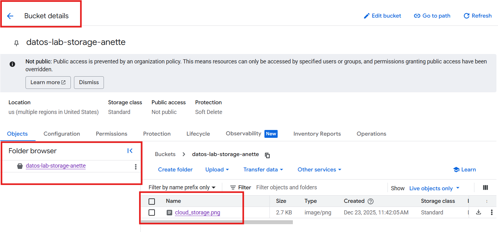

#### Paso 1. Acceder a los permisos del bucket
1. En Google Cloud Console, ir a **Cloud Storage → Buckets**.
2. Seleccionar el bucket creado anteriormente.
3. Ir a la pestaña **Permissions**.

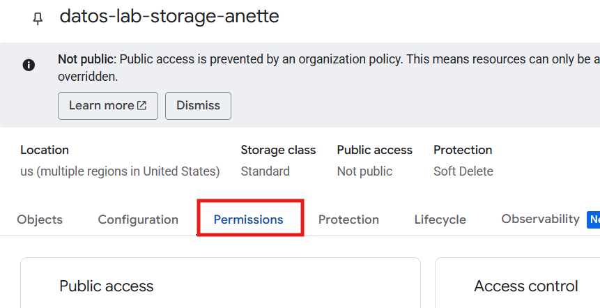
#### Paso 2. Otorgar acceso mínimo

1. Hacer clic en **Grant access**.

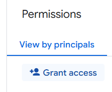

2. En el campo **New principals**, escribir el correo de un usuario de Google Cloud o cuenta de servicio existente.
3. En **Role**, en el apartado **Quick access**, seleccionar:
   - **Cloud Storage**
     - **Storage Object Viewer**

4. Guardar los cambios.

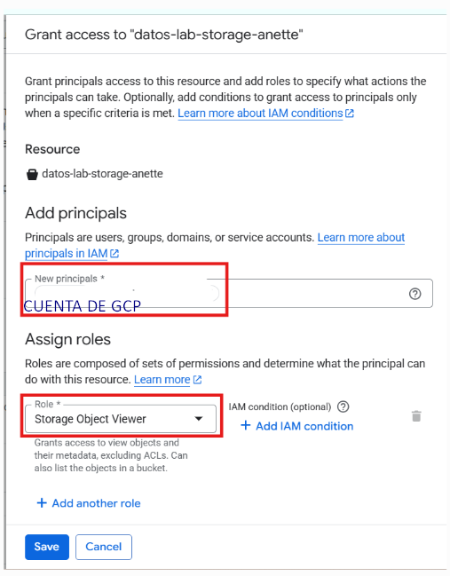

> Este rol permite únicamente **leer objetos**, sin modificar ni eliminar archivos.

#### Paso 3. Verificar protección contra acceso público
1. Ir a la pestaña **Configuration** del bucket.
2. Confirmar que **Public access prevention** esté configurado como **Enabled via org policy inheritance**.

-_Nota_ Esto significa que la organización impide el acceso público, incluso si alguien intenta habilitarlo manualmente.

Esto evita que el bucket o sus objetos se hagan públicos por error.

#### Paso 4. Comprobar el acceso al objeto
1. Seleccionar un archivo dentro del bucket.
2. Copiar la **Authenticated URL** del objeto, con el formato:
   https://storage.cloud.google.com/NOMBRE_DEL_BUCKET/NOMBRE_DEL_ARCHIVO

   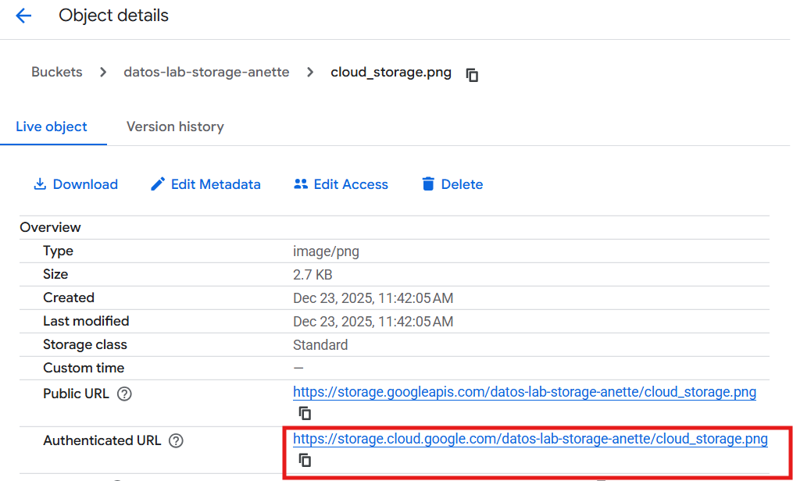
3. Abrir el enlace en el navegador:
   - Con el usuario autorizado → el archivo debe abrirse.
   - En una ventana incógnita → el acceso debe ser denegado.

---

**Resultado esperado:**
- El acceso al archivo funciona solo para usuarios autorizados.
- El bucket no es público.
- Se cumple el principio de mínimo privilegio mediante IAM.

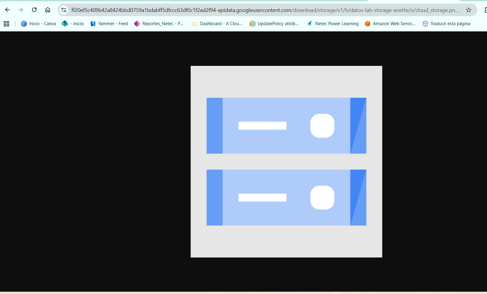

> Nota: Esta URL requiere que el usuario esté autenticado con una cuenta que tenga permisos sobre el bucket.

#### ¿Sabías que…?
En Google Cloud, el acceso a Cloud Storage se controla mediante **IAM**, no por enlaces públicos.
También existen **Signed URLs**, que permiten acceso temporal a objetos, pero estas se generan mediante código o CLI, no desde la consola gráfica.

## Conclusiones

En este laboratorio aprendiste a utilizar Google Cloud Storage como un servicio de almacenamiento de objetos seguro y escalable.

Puntos clave:
- Cloud Storage almacena archivos como **objetos** dentro de **buckets**.
- Los buckets deben tener nombres únicos a nivel global.
- El acceso a los archivos se controla mediante **IAM**, no por defecto de forma pública.
- Aplicar **mínimo privilegio** reduce riesgos de seguridad.
- La prevención de acceso público protege los datos contra exposiciones accidentales.

Cloud Storage es un componente fundamental en arquitecturas modernas para aplicaciones, analítica, respaldo y distribución de contenido.

### Fin del laboratorio 4
