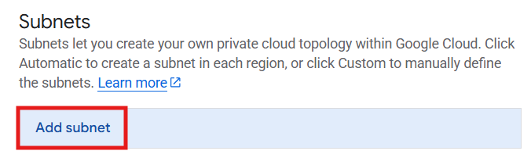
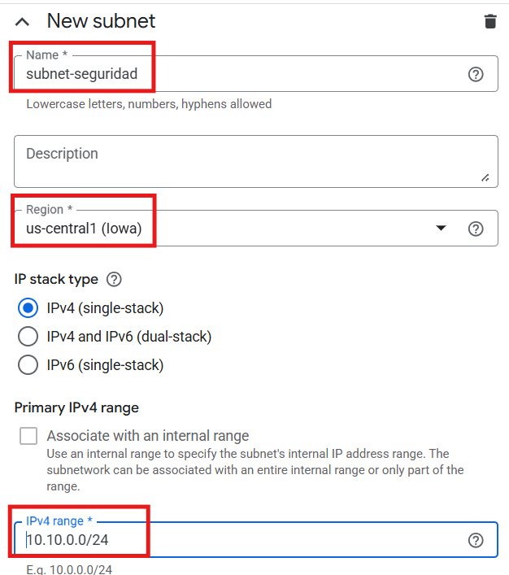
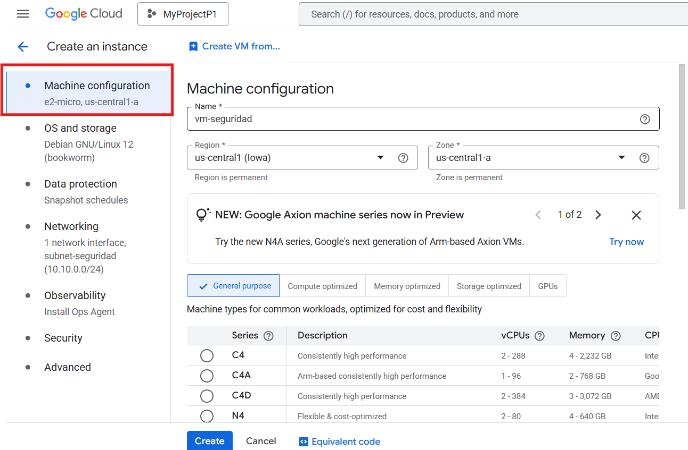
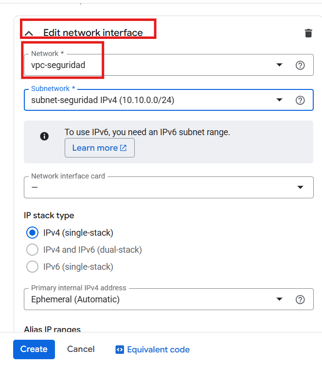
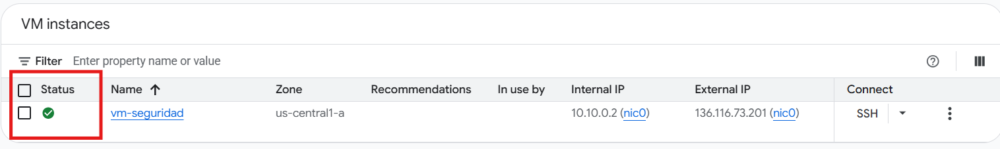
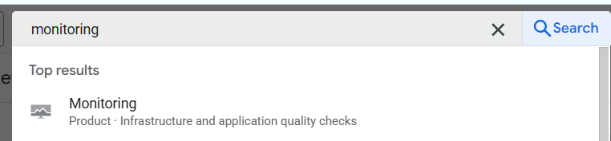
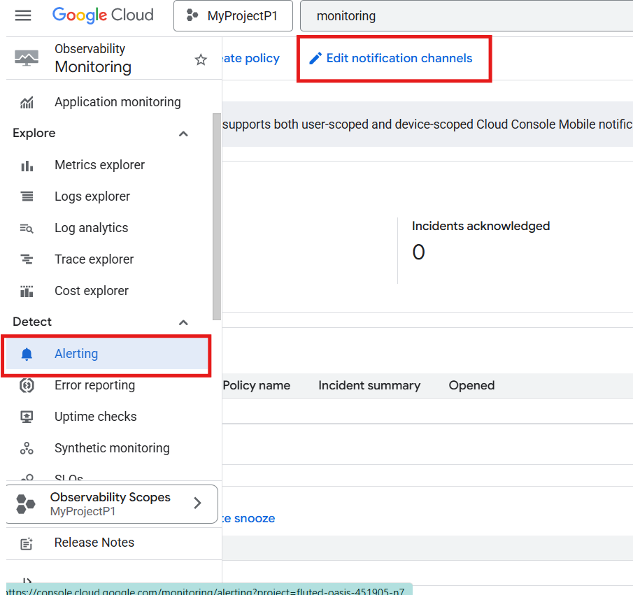
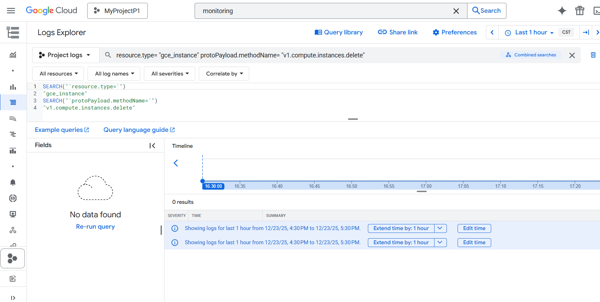
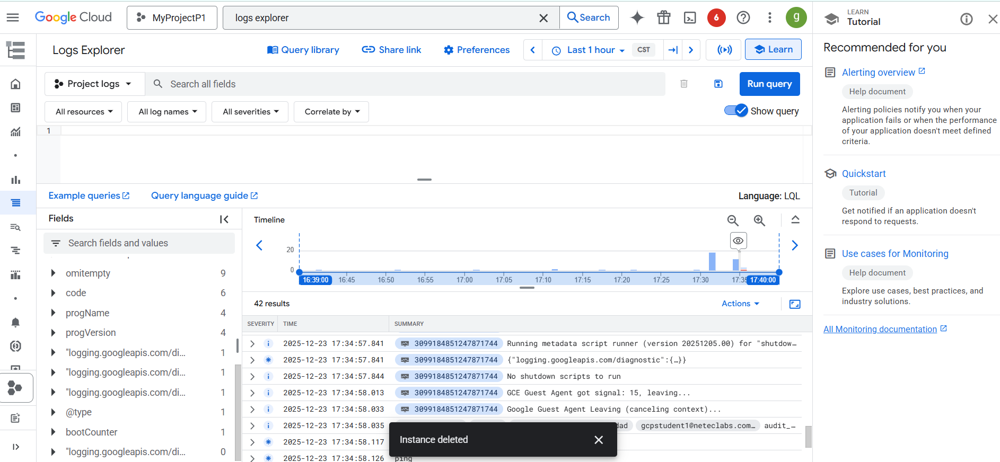

# Laboratorio 05: Seguridad, auditoría y detección de cambios en Google Cloud

## Objetivo de la práctica
Al finalizar la práctica, serás capaz de:
- Crear infraestructura de red y cómputo desde cero en Google Cloud.
- Comprender el modelo de responsabilidad compartida en la nube.
- Detectar la eliminación de recursos críticos mediante Audit Logs.
- Analizar eventos de seguridad mediante Audit Logs.
- Aplicar principios de confianza y cumplimiento en la nube.

---

## Objetivo visual
Representar el flujo de creación, eliminación y auditoría de una máquina virtual en Google Cloud.


---

## Duración aproximada
**45 minutos**

---

## Tabla de ayuda

| Elemento | Descripción |
|--------|------------|
| Plataforma | Google Cloud Platform |
| Navegador | Google Chrome (recomendado) |
| Servicios principales | VPC, Compute Engine, Cloud Monitoring, Audit Logs |
| Tipo de seguridad | Detección y auditoría |
| Proyecto | Proyecto activo de Google Cloud |

---

## Instrucciones

---

### Tarea 1. Comprender la seguridad y confianza en Google Cloud

Antes de crear recursos, es importante entender el modelo de seguridad en la nube.

#### ¿Sabías que…?
**Concepto: Responsabilidad compartida**

En Google Cloud:
- Google es responsable de la **seguridad de la nube** (infraestructura física, centros de datos).
- El cliente es responsable de la **seguridad en la nube** (redes, accesos, recursos, datos).

Esto implica que crear alertas y auditorías es responsabilidad del cliente.

---

### Tarea 2. Crear una red virtual (VPC) desde cero

En esta tarea crearás una red personalizada para alojar recursos de forma controlada.

Paso 1. Acceder a https://console.cloud.google.com.  

Paso 2. Verificar que exista un **proyecto activo**.  

Paso 3. En la barra de búsqueda, escribir **VPC networks** y seleccionarlo.

Paso 4. Hacer clic en **Create VPC network**.


Paso 5. Configurar la red con los siguientes valores:

| Configuración | Valor |
|--------------|------|
| Nombre | vpc-seguridad |
| Subnet creation mode | Custom |
| Descripcion| (Opcional)|
| MTU| 1460|

Paso 6. Desliza hasta  _**Subnet creation mode**_
Selecciona **Custom**

En la parte de _**Subnets**_ da click en Añadir subnet


Crear una subred con:
- Nombre: subnet-seguridad
- Región: us-central1
- Rango IP: 10.10.0.0/24

Paso 7. Hacer clic en **Create**.

---

#### ¿Sabías que…?
**Concepto: VPC**

Una VPC define el **perímetro de red** donde viven los recursos.
Sin una VPC, no es posible desplegar máquinas virtuales.

#### ¿Sabías que…?
**Concepto: Opciones avanzadas de subred**

- **Private Google Access** permite que recursos sin IP pública accedan a APIs de Google.
- **Flow Logs** registran el tráfico de red para auditoría y diagnóstico.
- **Hybrid Subnets** se usan en arquitecturas híbridas con on-premise o VPN.

En este laboratorio estas opciones se mantienen deshabilitadas para simplificar el entorno y enfocarse en redes, cómputo y auditoría básica.

---

### Tarea 3. Crear una máquina virtual en la VPC

En esta tarea desplegarás una VM que será usada para pruebas de seguridad.

Paso 1. En la consola, ir a **Compute Engine → VM instances**.

Paso 2. Hacer clic en **Create instance**.


## Secciones de configuración de la máquina virtual
Durante la creación de una VM aparecen varias secciones. En este laboratorio **la mayoría se dejan por defecto**, pero es importante saber para qué sirven.

### Machine configuration
Define el tipo de máquina (CPU y memoria).
- Se usa `e2-micro` por ser económica.

Paso 3. Configurar la VM con los siguientes valores:

| Configuración | Valor |
|--------------|------|
| Nombre | vm-seguridad |
| Región | us-central1 |
| Zona | us-central1-a |
| Serie | E2 |
| Tipo de máquina | e2-micro |



### OS and storage
Permite elegir el sistema operativo y el disco.
- Se usa Debian Linux. **Dejar por defecto**.

### Data protection
Configura snapshots automáticos para proteger datos.
- No se requiere en el lab. **Dejar por defecto**.

### Networking 
Durante la creación de la máquina virtual, es necesario asociarla a la VPC creada previamente.

1. En la sección **Networking**, localizar **Network interface 1**.
2. En el campo **Network**, seleccionar la VPC creada (ej. `vpc-seguridad`).
3. En el campo **Subnetwork**, seleccionar la subred correspondiente (ej. `subnet-seguridad`).
4. Mantener las siguientes opciones por defecto:
   - Network tags: vacío
   - Hostname: valor automático
   - IP forwarding: deshabilitado

Esto garantiza que la VM quede correctamente aislada dentro de la red definida.



### Observability
Habilita monitoreo y logs con Ops Agent.
- No necesario para el lab. **Dejar deshabilitado**.

### Security
Opciones de protección de la VM (Shielded VM, Secure Boot).
- Mantener valores recomendados. **Dejar por defecto**.

### Advanced
Configuraciones avanzadas (scripts, metadatos).
- No se usa en este lab. **Dejar por defecto**.


Paso 4. Mantener el resto de opciones por defecto.

Paso 5. Hacer clic en **Create**.

Espera a que aparezca creado 


---

#### ¿Sabías que…?
**Concepto: Máquina virtual**

Una VM es un recurso de cómputo que ejecuta un sistema operativo.
Eliminar una VM es un evento crítico que debe ser monitoreado.

---

### Tarea 4. Detectar la eliminación de máquinas virtuales mediante Audit Logs

En esta tarea identificarás eventos críticos de seguridad mediante Audit Logs.


Paso 1. En la consola, buscar **Monitoring**.



Paso 2. Ir a **Alerting** y seleccionar **Edit notification channels**.




- Seleccionar Email
- Agregar tu correo
- Agrega tu nombre 
- Selecciona _**Guardar**_
> Nota:
> En este laboratorio solo se configuran los canales de notificación como referencia.
> La detección del evento se realiza mediante **Audit Logs**, no mediante una alerta automática.

Paso 3. Ir a Logs Explorer (Activity Log de GCP)

Ir a Logging → Logs Explorer
Usar este filtro (tal cual):

```sql
resource.type="gce_instance"
protoPayload.methodName="v1.compute.instances.delete"
```


_Nota_ Por qué ves “No data found” (esto es NORMAL)

No es un error ❌

Significa simplemente que:

En el rango de tiempo seleccionado NO se ha eliminado ninguna VM

Los Audit Logs solo aparecen cuando ocurre el evento.

Paso 4. Si aún no hay resultados, haz esto:

- Ve a Compute Engine → VM instances

- Elimina una VM de prueba

- Regresa a Logs Explorer




---

#### ¿Sabías que…?
**Concepto: Alertas de seguridad**

Las alertas permiten detectar eventos críticos en tiempo casi real,
reduciendo el tiempo de respuesta ante incidentes.

---

## Conclusiones

En este laboratorio se implementaron y analizaron controles básicos de seguridad en Google Cloud desde una perspectiva práctica y alineada a escenarios reales.

### Puntos clave aprendidos

- La seguridad en Google Cloud se basa en un **modelo de responsabilidad compartida**, donde:
  - Google protege la infraestructura física y los centros de datos.
  - El cliente es responsable de la configuración de redes, accesos, recursos y datos.

- Las **VPCs** permiten definir perímetros de red controlados, siendo la base para una arquitectura segura en la nube.

- Las **máquinas virtuales** son recursos críticos cuyo ciclo de vida debe ser monitoreado, especialmente ante acciones administrativas como su eliminación.

- Google Cloud registra automáticamente acciones administrativas mediante **Audit Logs**, lo que permite identificar:
  - Quién realizó la acción  
  - Qué acción se ejecutó  
  - Cuándo ocurrió  
  - Sobre qué recurso  

- La eliminación de una máquina virtual es un **evento sensible** que puede detectarse y analizarse mediante Audit Logs sin necesidad de configuraciones adicionales.

- No todos los escenarios de seguridad requieren alertas automáticas; en muchos casos, la **auditoría y revisión de eventos** es suficiente para cumplir objetivos de seguridad y cumplimiento.

- La revisión de **logs de auditoría** es fundamental para:
  - Cumplimiento normativo  
  - Investigación de incidentes  
  - Buenas prácticas de seguridad  

Este laboratorio demuestra que la seguridad en la nube **no es automática**, sino que debe ser:

> **Diseñada, monitoreada y auditada conscientemente.**

Google Cloud proporciona las herramientas necesarias; el uso correcto depende del diseño y las decisiones del usuario.

### Fin del laboratorio 5