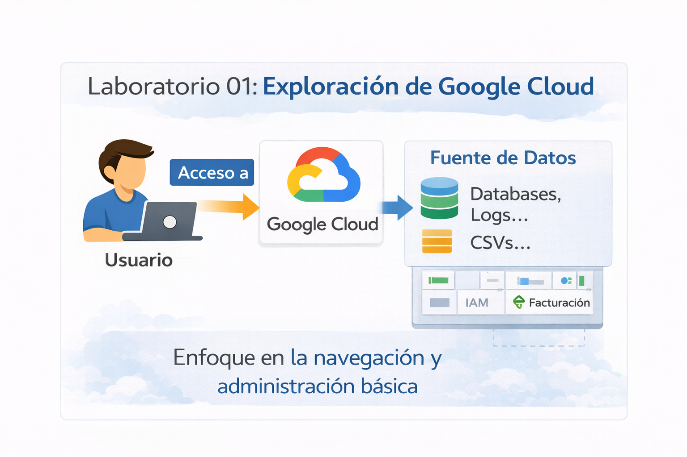
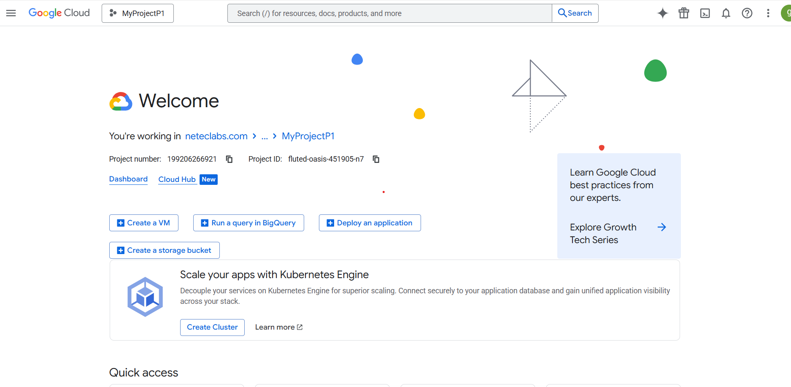
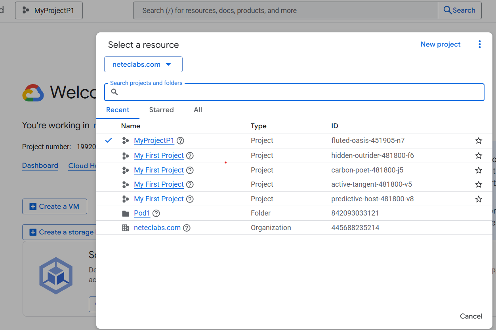
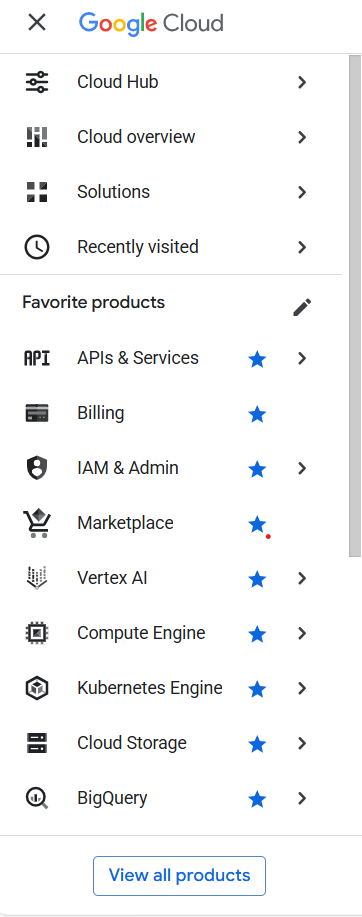
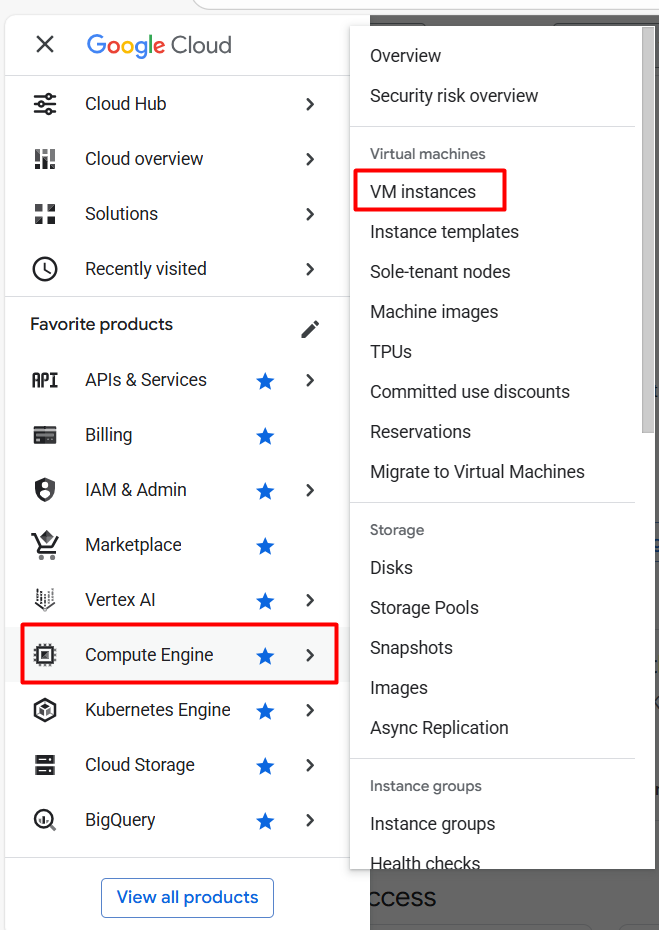
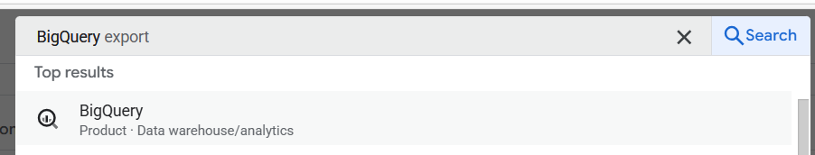
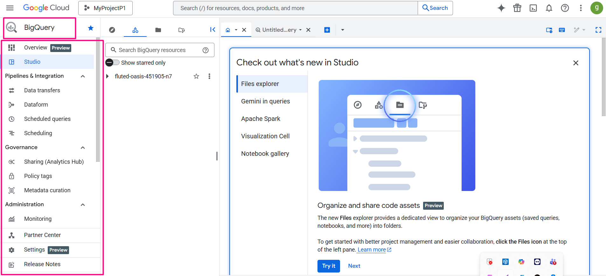
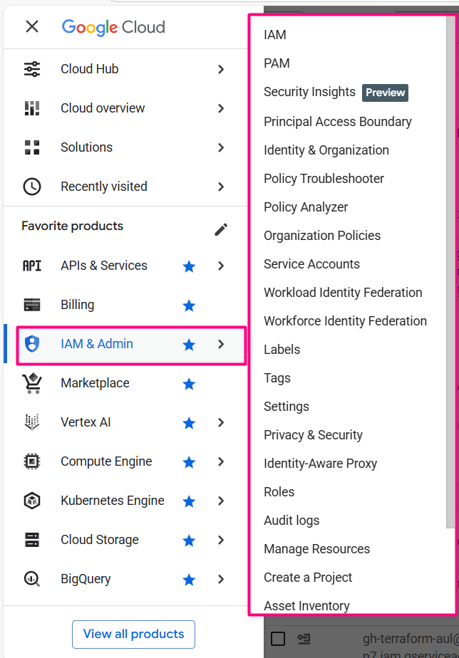

# Laboratorio 01: Exploración de Google Cloud Console

## Objetivo de la práctica:
Al finalizar la práctica, serás capaz de:
- Reconocer la estructura general de Google Cloud Console.
- Comprender el concepto de proyecto en Google Cloud.
- Identificar los principales elementos de navegación y administración.

## Objetivo Visual 
Crear un diagrama o imagen que resuma las actividades a realizar.

## Duración aproximada: 20 minutos

## Tabla de ayuda:

| Elemento | Descripción |
| --- | --- |
| Plataforma | Google Cloud Platform |
| Navegador | Google Chrome (recomendado) |
| Cuenta requerida | Cuenta activa de Google |
| Creación de recursos | No aplica |

## Instrucciones

### Tarea 1. Acceder a Google Cloud Console
Paso 1. Acceder a la URL https://console.cloud.google.com.  

Paso 2. Iniciar sesión utilizando una cuenta de Google válida.  

Paso 3. Esperar a que cargue la pantalla principal de Google Cloud Console.  

#### ¿Sabías que…?
Google Cloud Console es la interfaz web central desde donde se administran todos los servicios de Google Cloud, incluyendo cómputo, almacenamiento, redes, datos, seguridad e inteligencia artificial.

---

### Tarea 2. Identificar el proyecto activo
Paso 1. Localizar el selector de proyecto en la parte superior de la consola.  

Paso 2. Hacer clic sobre el nombre del proyecto activo.  

Paso 3. Revisar las opciones disponibles en el selector de proyectos y cerrarlo.  

#### ¿Sabías que…?
**Concepto: ¿Qué es un proyecto?**  

Un proyecto es la unidad organizacional básica en Google Cloud.  
Todos los recursos (máquinas virtuales, bases de datos, buckets, APIs, etc.) deben pertenecer a un proyecto.  

Un proyecto permite:
- Agrupar recursos relacionados.
- Controlar accesos mediante IAM.
- Asociar consumo a facturación.
- Separar ambientes (desarrollo, pruebas y producción).

---

### Tarea 3. Explorar el menú de navegación
Paso 1. Hacer clic en el menú de navegación (ícono ☰).  

Paso 2. Identificar visualmente las principales secciones del menú:
- Compute
- Storage
- Networking
- Big Data
- AI & Machine Learning  

Paso 3. Cerrar el menú de navegación.  

#### ¿Sabías que…?
Google Cloud organiza sus servicios por dominios tecnológicos para facilitar la adopción de la nube y acelerar la transformación digital de las organizaciones.

---

### Tarea 4. Identificar los modelos de servicio desde la consola
Paso 1. Localizar el servicio _Compute Engine_ en el menú de navegación.  

Paso 2. En la barra de búsqueda del portal de Google Cloud, escribe _App Engine_ y selecciona el servicio dentro de la categoría Cómputo. 

Paso 3. En la parte superior del portal de Google Cloud, escribe _BigQuery_ en la barra de búsqueda para acceder a este servicio completamente administrado.

En esta sección, observa el panel de navegación ubicado en el lado izquierdo de la consola del servicio.

- Este panel concentra todas las funcionalidades disponibles del servicio seleccionado y será el punto principal desde donde se realizan las tareas de configuración, administración y operación.

- Desde la barra izquierda podrás:

- Acceder a la vista general del servicio.

- Localizar el área de trabajo principal donde se ejecutan las operaciones (consultas, despliegues, configuraciones, etc.).

- Identificar opciones relacionadas con integración, automatización y programación.

- Revisar funcionalidades de gobernanza, seguridad y control de acceso.

- Acceder a herramientas de monitoreo y configuración del servicio.

 - **Nota**:
Aunque las opciones específicas pueden variar entre servicios de Google Cloud, este panel siempre cumple la misma función: centralizar la navegación y administración del servicio durante el laboratorio.

#### ¿Sabías que…?
Los modelos de servicio en la nube se reflejan directamente en los servicios:
- **IaaS – Compute Engine**:  
  Permite crear y administrar máquinas virtuales, donde el usuario gestiona el sistema operativo y la configuración.

- PaaS – App Engine:
Plataforma administrada para desplegar aplicaciones sin gestionar servidores.

- SaaS – BigQuery:
Servicio totalmente administrado para análisis de datos, accesible mediante consultas SQL.
---

### Tarea 5. Identificar elementos de administración y control
Paso 1. Localizar el menú IAM y administración.  

Paso 2. Identificar visualmente las opciones de:
- IAM
- Facturación
- Auditoría  

Paso 3. Regresar a la pantalla principal de la consola.  

#### ¿Sabías que…?
En el modelo de responsabilidad compartida, Google es responsable de la infraestructura física, mientras que el cliente es responsable de la gestión de accesos, configuraciones y datos.

---

## Resultado esperado

Al finalizar el laboratorio, el participante reconoce la estructura de Google Cloud Console, comprende qué es un proyecto y puede navegar por los principales componentes de la plataforma.

## Conclusiones

En este laboratorio el participante obtuvo una primera aproximación práctica a Google Cloud, enfocándose en la exploración y comprensión de su consola de administración.

Puntos clave aprendidos:

- Google Cloud Console es la interfaz central para administrar todos los servicios de la plataforma.
- Un **proyecto** es la unidad organizacional básica y obligatoria para crear y gestionar recursos en Google Cloud.
- La consola organiza los servicios por dominios tecnológicos, facilitando la navegación y el entendimiento de la plataforma.
- Los modelos de servicio en la nube (**IaaS, PaaS y SaaS**) se reflejan directamente en servicios como Compute Engine, App Engine y BigQuery.
- Los componentes de **IAM, facturación y auditoría** son fundamentales para el control, la seguridad y la gobernanza de los recursos.

Este laboratorio establece las bases necesarias para los siguientes módulos, permitiendo al participante familiarizarse con el entorno, la navegación y los conceptos esenciales antes de comenzar a crear y administrar recursos en Google Cloud.

## Conclusiones
