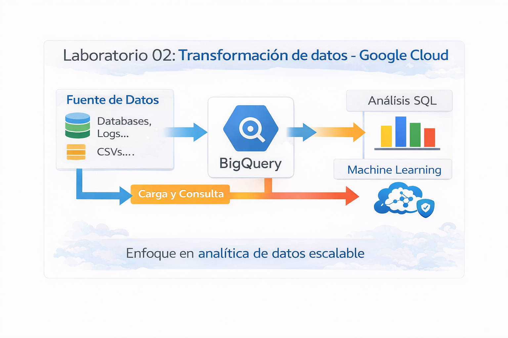
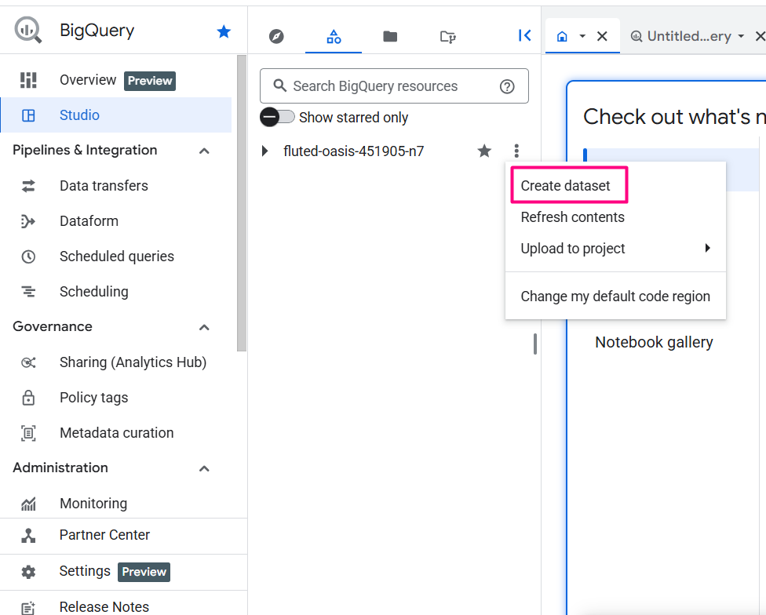
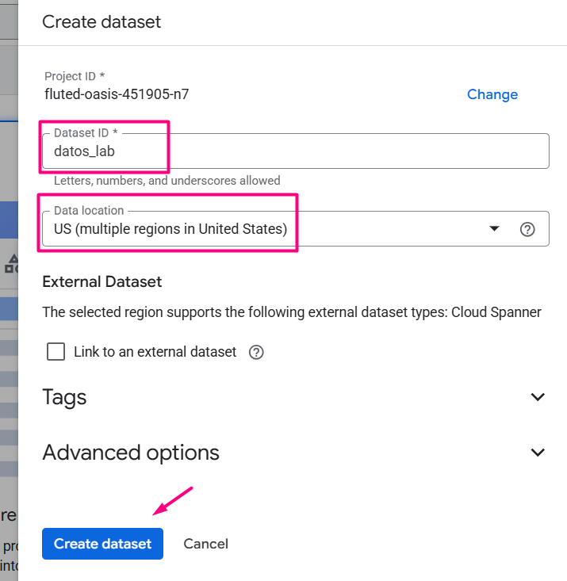
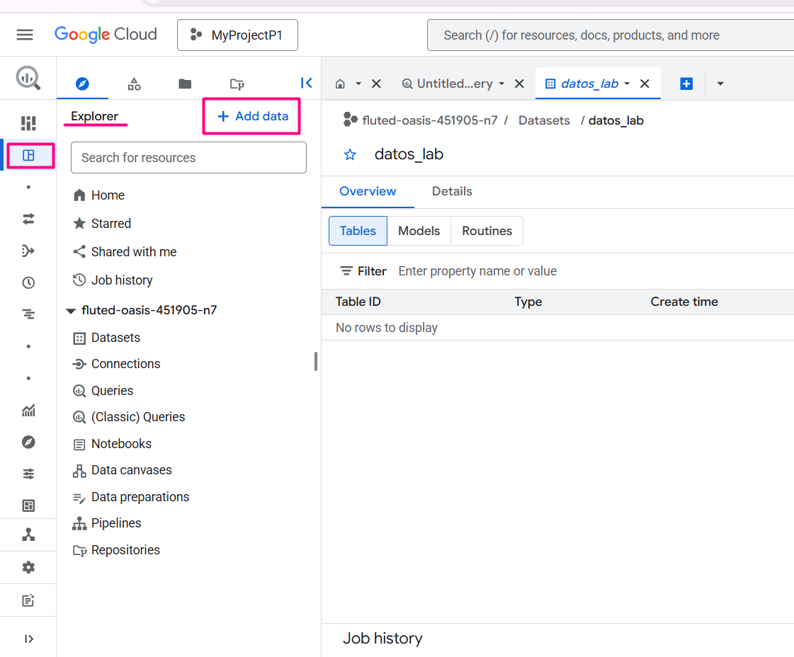
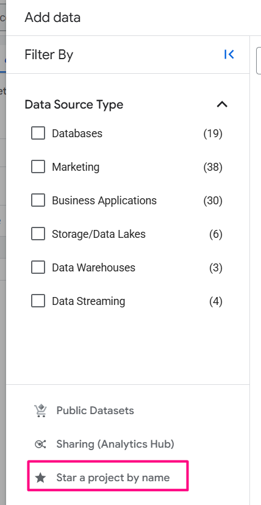
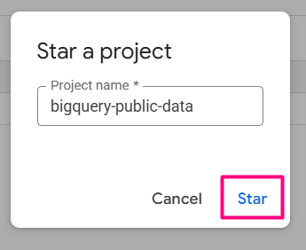
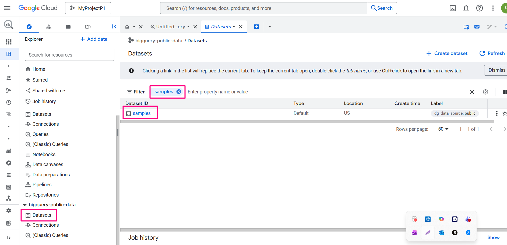

# Laboratorio 02: Transformación de datos con Google Cloud

## Objetivo de la práctica
Al finalizar la práctica, serás capaz de:
- Crear un conjunto de datos en BigQuery.
- Explorar datasets públicos disponibles en Google Cloud.
- Ejecutar una consulta SQL básica para analizar datos.
- Comprender cómo Google Cloud habilita la analítica de datos a gran escala.

---

## Objetivo visual
Representar el flujo de datos desde una fuente pública hasta su análisis en BigQuery.



---

## Duración aproximada 40 minutos.

---

## Tabla de ayuda

| Elemento | Descripción |
|--------|------------|
| Plataforma | Google Cloud Platform |
| Navegador | Google Chrome (recomendado) |
| Servicio principal | BigQuery |
| Tipo de datos | Dataset público |
| Lenguaje | SQL |
| Proyecto | Proyecto activo de Google Cloud |

---

## Instrucciones

### Tarea 1. Acceder a BigQuery desde Google Cloud Console

Paso 1. Acceder a https://console.cloud.google.com.  

Paso 2. Verificar que exista un **proyecto activo** en la parte superior de la consola.  

Paso 3. Ir a la barra de búsqueda y selecciona **BigQuery**.

#### ¿Sabías que…?
**Concepto: ¿Qué es BigQuery?**  

BigQuery es un servicio de analítica de datos totalmente administrado y sin servidor (serverless) que permite analizar grandes volúmenes de datos usando SQL, sin necesidad de administrar infraestructura.

---

### Tarea 2. Crear un conjunto de datos en BigQuery

Paso 1. En BigQuery Studio, identificar el proyecto activo en el panel izquierdo.  

Paso 2. Hacer clic en el ícono de **tres puntos** junto al nombre del proyecto y seleccionar **Crear conjunto de datos**.  



Paso 3. Configurar el conjunto de datos con los siguientes valores:

| Configuración | Acción |
|--------------|--------|
| ID del conjunto de datos | `datos_lab` |
| Ubicación | **US (multirregión)** |
| External dataset | No seleccionar |
| Tags | Dejar por defecto |
| Advanced options | Dejar por defecto |

Paso 4. Hacer clic en **Crear conjunto de datos**.

#### ¿Sabías que…?
**Concepto: ¿Qué es un Dataset?**  

Un dataset es un contenedor lógico que organiza tablas y vistas dentro de BigQuery.  
Permite administrar permisos, ubicación y políticas de retención de datos.

---

#### ¿Sabías que…?
**Concepto: Ubicación del Dataset (Data location)**  

La ubicación define dónde se almacenan físicamente los datos.  
Usar **US (multirregión)** facilita la compatibilidad con datasets públicos y mejora la disponibilidad.

---

#### ¿Sabías que…?
**Concepto: External Dataset**  

Permite consultar datos almacenados fuera de BigQuery (por ejemplo, en Cloud Storage).  
En este laboratorio **no se utiliza**, por lo que se deja sin seleccionar.

---

### Tarea 3. Explorar datasets públicos en BigQuery

Paso 1. En BigQuery Studio, ubicar el panel **Explorer** del lado izquierdo.

Paso 2. Hacer clic en el botón **+ ADD**.



Paso 3. Seleccionar la opción **Star a project by name**.



Paso 4. Escribir `bigquery-public-data` y hacer clic en **STAR**.


Paso 5. Expandir el proyecto **bigquery-public-data**.

Paso 6. Hacer clic en la opción **Datasets**.

Paso 7. En la lista de datasets públicos, localizar y seleccionar el dataset **samples**.




Paso 8. Abrir la pestaña **Tables**.

Paso 9. Seleccionar la tabla **shakespeare** y revisar su vista previa y esquema.

#### ¿Sabías que…?
#### ¿Sabías que…?
**Concepto: ¿Qué es el esquema (Schema) de una tabla?**

El Schema define la estructura de una tabla en BigQuery.
Describe qué columnas existen, qué tipo de datos contienen y si son obligatorias.

En tu caso, la tabla shakespeare tiene:
| Campo| Tipo | Significado|
|--------------|--------|-------------|
|word	|STRING	|Palabra encontrada en la obra|
|word_count|	INTEGER|	Número de veces que aparece la palabra|
|corpus	|STRING|	Obra de Shakespeare|
|corpus_date|	INTEGER|	Año de la obra|

Google Cloud ofrece **datasets públicos** que pueden analizarse sin costo de almacenamiento, permitiendo experimentar con datos reales sin cargar información propia.

---
### Tarea 4. Ejecutar una consulta SQL en BigQuery

En esta tarea ejecutarás tu primera consulta SQL en BigQuery utilizando un dataset público.  
El objetivo es analizar datos reales sin necesidad de cargarlos manualmente.

Paso 1. Asegúrate de tener abierta la tabla **shakespeare** del dataset público.

Paso 2. En la parte superior de la tabla, haz clic en el botón **Query** (Consultar).
- Esto abrirá una nueva pestaña con el editor SQL de BigQuery.

Paso 3. Borrar cualquier contenido existente en el editor y pegar la siguiente consulta SQL:

```sql
SELECT
  word,
  SUM(word_count) AS total_apariciones
FROM
  `bigquery-public-data.samples.shakespeare`
GROUP BY
  word
ORDER BY
  total_apariciones DESC
LIMIT 10;

```
Paso 4. Hacer clic en el botón **Run (Ejecutar)** ubicado en la parte superior del editor SQL.

Paso 5. Esperar a que la consulta finalice y revisar la sección **Query results** en la parte inferior de la pantalla.

Paso 6. Identificar las columnas word y total_apariciones, las cuales muestran las palabras más utilizadas en las obras de Shakespeare.

Resultado esperado:
Se mostrarán las 10 palabras más utilizadas en las obras de Shakespeare junto con su número total de apariciones, ordenadas de mayor a menor.

¿Sabías que…?

BigQuery utiliza un modelo de pago por consulta, lo que significa que solo se cobra por los datos procesados.
Por esta razón, analizar datasets públicos es ideal para aprender sin incurrir en costos elevados.

---

## Conclusiones

- BigQuery permite analizar grandes volúmenes de datos sin necesidad de administrar servidores ni infraestructura, gracias a su modelo **serverless**.
- Los **datasets públicos** de Google Cloud facilitan el aprendizaje y la experimentación con datos reales sin incurrir en costos de almacenamiento.
- Un **dataset** organiza tablas y vistas, y es la unidad lógica básica para la gestión de datos en BigQuery.
- El **lenguaje SQL** es una herramienta fundamental para la analítica de datos, permitiendo agrupar, filtrar y ordenar información de manera eficiente.
- Google Cloud habilita la **analítica a gran escala** combinando rendimiento, escalabilidad y simplicidad operativa.
- Este laboratorio demuestra cómo la transformación digital basada en datos comienza con el acceso, exploración y análisis de información confiable.

### Fin del laboratorio 2