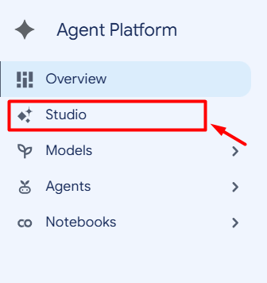
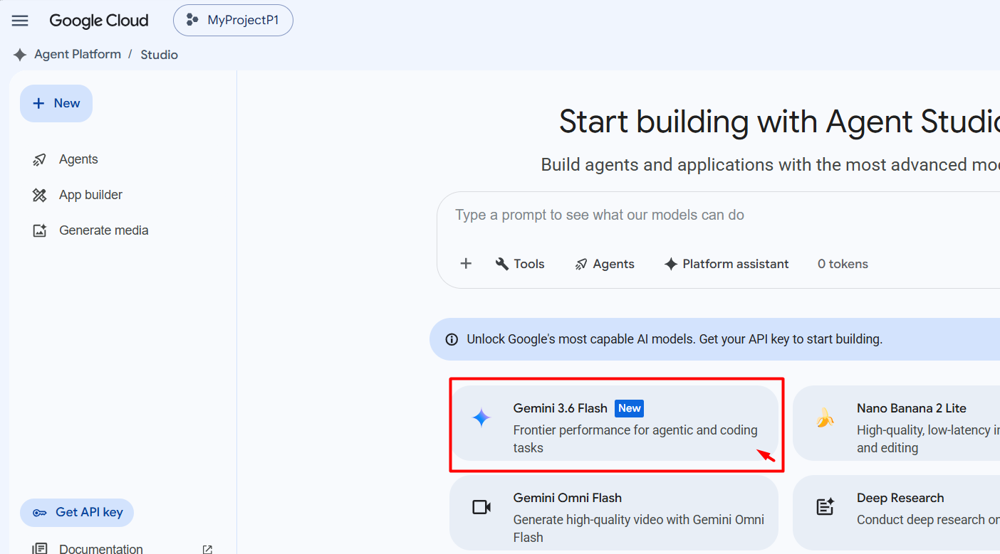
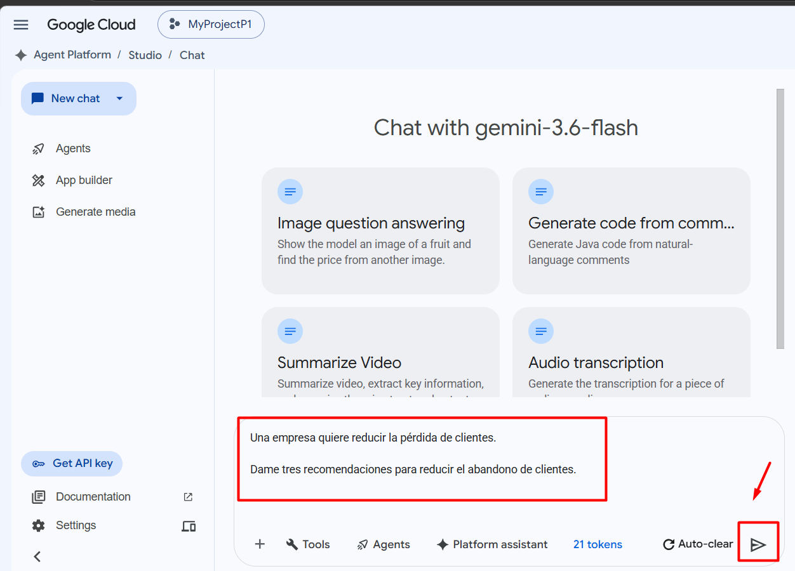
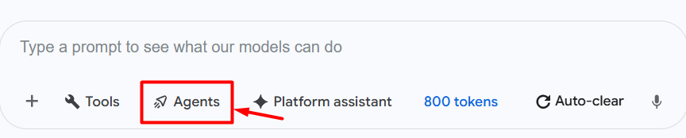
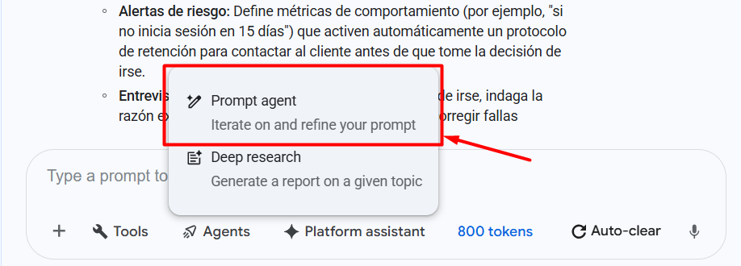

# Laboratorio 03: Analizar riesgo de abandono y simular un agente con Gemini en Google Cloud

## Objetivo de la práctica

Al finalizar la práctica, serás capaz de:

- Utilizar **Studio** dentro de **Agent Platform**.
- Ejecutar prompts con **Gemini**.
- Comparar cómo cambia una respuesta cuando mejora la calidad de los datos.
- Relacionar el uso de la Inteligencia Artificial con un problema de negocio.
- Identificar riesgos relacionados con **Responsible AI**.
- Comprender el propósito de **Explainable AI**.
- Diferenciar entre **Gemini**, **Agent Platform**, **AutoML**, **APIs preentrenadas** y **modelos personalizados**.
- Simular el comportamiento de una solución de **Agentic AI** mediante un **Prompt agent**.

---

## Objetivo visual

Representar la evolución desde una interacción generativa hasta una solución agéntica:

**Datos básicos → Gemini → Respuesta general**

**Datos de calidad → Gemini → Respuesta más específica**

**Objetivo → Prompt agent → Datos + herramientas → Evaluación → Acción o escalamiento**


---

## Duración aproximada

**20 minutos**

---

## Tabla de ayuda

| Elemento | Descripción |
|---|---|
| Plataforma | Google Cloud |
| Navegador | Google Chrome (recomendado) |
| Servicio principal | Agent Platform |
| Área de trabajo | Studio |
| Modelo | Gemini disponible |
| Tipo de IA | Generative AI y Agentic AI |
| Programación | No requerida |
| Caso de negocio | Reducción del abandono de clientes |
| Proyecto | Proyecto activo de Google Cloud |

---

## Instrucciones

### Tarea 1. Acceder a Agent Platform

Paso 1. Acceder a:

https://console.cloud.google.com

Paso 2. Iniciar sesión con una cuenta de Google válida.

Paso 3. Verificar que exista un **proyecto activo** en la parte superior de la consola.

Paso 4. En la barra de búsqueda escribir:

**Agent Platform**

Paso 5. Seleccionar **Agent Platform**.

Paso 6. Verificar que aparezca la pantalla principal de Agent Platform.

En el menú lateral deben observarse opciones similares a:

- **Overview**
- **Studio**
- **Models**
- **Agents**
- **Notebooks**

> **Nota:** Las opciones visibles pueden variar según los permisos y las actualizaciones de Google Cloud.

---

#### ¿Sabías que…?

**Concepto: Agent Platform**

Agent Platform reúne capacidades para trabajar con modelos y soluciones basadas en agentes dentro de Google Cloud.

Desde la plataforma es posible acceder a áreas relacionadas con:

- modelos de IA;
- Generative AI;
- agentes;
- experimentación;
- desarrollo;
- notebooks.

---

### Tarea 2. Acceder a Studio

Paso 1. En el menú lateral seleccionar:

**Studio**



Paso 2. Esperar a que cargue el área de trabajo.

Paso 3. Crear una nueva interacción de texto o chat.

Paso 4. Verificar que se encuentre seleccionado un modelo **Gemini** disponible.


> **Nota:** El nombre y la versión del modelo pueden variar según el proyecto y la disponibilidad del servicio.

Paso 5. Mantener la configuración predeterminada.

---

#### ¿Sabías que…?

**Concepto: Gemini**

Gemini es una familia de modelos de IA generativa capaz de trabajar con lenguaje natural y, dependiendo del modelo, con múltiples tipos de información.

En este laboratorio se utilizará Gemini para:

- analizar información;
- generar recomendaciones;
- comparar resultados;
- simular el comportamiento de un agente.

---

### Tarea 3. Ejecutar un prompt con pocos datos

En esta tarea observarás cómo responde Gemini cuando recibe poca información.

Paso 1. Escribir el siguiente prompt:

```text
Una empresa quiere reducir la pérdida de clientes.

Dame tres recomendaciones para reducir el abandono de clientes.
```

Paso 2. Ejecutar el prompt.

Paso 3. Revisar la respuesta.

---

## Resultado esperado

Gemini puede generar recomendaciones generales relacionadas con:

- mejorar la atención al cliente;
- ofrecer promociones;
- analizar clientes insatisfechos;
- personalizar comunicaciones;
- mejorar productos o servicios.

Los resultados exactos pueden variar.

---

### Tarea 4. Mejorar la calidad de los datos

Ahora proporcionarás mayor contexto para comprobar cómo cambia la respuesta.

Paso 1. Crear una nueva interacción o reemplazar el prompt anterior.

Paso 2. Escribir:

```text
Una empresa de telecomunicaciones tiene:

- 20,000 clientes.
- Una tasa anual de abandono del 18 %.
- Las principales causas de abandono son precio, mala atención y fallas del servicio.
- Los clientes con más de tres incidencias tienen mayor probabilidad de abandonar.
- El objetivo de la empresa es reducir el abandono en un 10 %.

Propón tres acciones basadas en inteligencia artificial.

Para cada acción indica:

1. Qué problema resuelve.
2. Qué datos utilizaría.
3. Qué beneficio genera para el negocio.
4. Qué indicador debería medirse.
```

Paso 3. Ejecutar el prompt.

Paso 4. Comparar esta respuesta con la respuesta obtenida en la tarea anterior.

---

## Resultado esperado

La segunda respuesta debería ser más específica porque Gemini dispone de mayor contexto.

Completar la siguiente tabla:

| Aspecto | Prompt 1 | Prompt 2 |
|---|---|---|
| Cantidad de datos | Pocos | Más completos |
| Nivel de detalle | Bajo | Mayor |
| Recomendaciones específicas | Limitadas | Más específicas |
| Uso de métricas | Bajo | Mayor |
| Utilidad para el negocio | General | Mayor |

---

#### ¿Sabías que…?

**Concepto: Calidad de los datos**

Los modelos de IA dependen de la información disponible.

Datos:

- completos;
- relevantes;
- recientes;
- consistentes;
- representativos;

pueden ayudar a obtener resultados más útiles.

Una mayor cantidad de datos no garantiza por sí sola mejores resultados. También importa su calidad.

---

### Tarea 5. Relacionar la IA con valor de negocio

Paso 1. Revisar las recomendaciones generadas por Gemini.

Paso 2. Identificar cuáles de los siguientes beneficios aparecen:

- reducción de costos;
- aumento de productividad;
- mejora en la experiencia del cliente;
- reducción del abandono;
- automatización de tareas;
- apoyo a la toma de decisiones.

Paso 3. Seleccionar una recomendación.

Paso 4. Identificar un indicador que permita medir su impacto.

Ejemplos:

- tasa de abandono;
- satisfacción del cliente;
- tiempo promedio de respuesta;
- cantidad de incidencias;
- tasa de retención.

---

#### ¿Sabías que…?

**Concepto: Valor de negocio de la IA**

La Inteligencia Artificial genera valor cuando ayuda a mejorar un resultado empresarial.

Por ejemplo:

**IA → Detección temprana de clientes en riesgo → Acción de retención → Menor abandono**

La tecnología debe relacionarse con una necesidad y un resultado medible.

---

### Tarea 6. Identificar la solución de IA adecuada

Paso 1. En una nueva interacción escribir:

```text
Para el escenario anterior, compara las siguientes opciones de Google Cloud:

- API preentrenada
- Gemini
- Agent Platform
- AutoML
- Modelo personalizado

Indica cuál utilizarías si:

1. Solo necesito generar recomendaciones.
2. Quiero predecir qué clientes abandonarán utilizando datos históricos propios.
3. Quiero automatizar acciones después de detectar un cliente en riesgo.
4. Necesito resolver una tarea específica disponible mediante una API ya entrenada.
5. Necesito control avanzado sobre el entrenamiento y el modelo.

Explica brevemente cada elección.
```

Paso 2. Ejecutar el prompt.

Paso 3. Revisar el resultado.

---

## Resultado esperado

La respuesta debería aproximarse a:

| Necesidad | Alternativa |
|---|---|
| Generar recomendaciones | Gemini |
| Predecir abandono con datos históricos | AutoML |
| Automatizar acciones | Agent Platform |
| Resolver una tarea especializada | API preentrenada |
| Control avanzado | Modelo personalizado |

---

#### ¿Sabías que…?

**Concepto: Diferentes enfoques de IA**

No todos los problemas requieren la misma solución.

- **API preentrenada**: resuelve tareas específicas utilizando modelos ya disponibles.
- **Gemini**: permite generar, analizar y transformar contenido.
- **Agent Platform**: permite diseñar soluciones orientadas a objetivos, herramientas y acciones.
- **AutoML**: facilita la creación de modelos utilizando datos propios.
- **Modelo personalizado**: ofrece mayor control sobre entrenamiento, arquitectura y configuración.

---

### Tarea 7. Analizar Responsible AI

Paso 1. Escribir:

```text
La empresa quiere utilizar automáticamente las predicciones
para decidir qué clientes reciben descuentos.

Identifica:

1. Tres riesgos.
2. Qué datos podrían generar sesgos.
3. Qué decisión debería revisar una persona.
4. Qué controles recomendarías.
```

Paso 2. Ejecutar el prompt.

Paso 3. Revisar los riesgos identificados.

---

## Resultado esperado

Gemini puede mencionar aspectos relacionados con:

- sesgo;
- privacidad;
- discriminación;
- datos incompletos;
- falta de transparencia;
- decisiones injustas;
- ausencia de supervisión humana.

---

#### ¿Sabías que…?

**Concepto: Responsible AI**

Responsible AI busca que las soluciones de Inteligencia Artificial sean utilizadas de forma:

- segura;
- justa;
- responsable;
- transparente;
- controlada.

Las decisiones de alto impacto no deberían automatizarse sin evaluar riesgos y mecanismos de supervisión.

---

### Tarea 8. Analizar Explainable AI

Paso 1. Escribir:

```text
Un modelo predice que un cliente tiene alta probabilidad de abandonar.

¿Cuál de estas respuestas es más útil para una empresa?

A. "El cliente tiene alto riesgo."

B. "El cliente tiene alto riesgo principalmente por:
- cuatro incidencias recientes,
- aumento del precio,
- baja satisfacción."

Explica por qué.
```

Paso 2. Ejecutar el prompt.

---

## Resultado esperado

La opción **B** debería ser más útil porque proporciona información sobre los factores relacionados con el resultado.

---

#### ¿Sabías que…?

**Concepto: Explainable AI**

Explainable AI busca ayudar a comprender por qué un modelo produce una determinada predicción o recomendación.

Esto puede ser importante para:

- generar confianza;
- revisar resultados;
- detectar problemas;
- facilitar auditorías;
- apoyar decisiones humanas.

---

### Paso previo. Cambiar de Chat a Agent

Hasta este punto has utilizado Gemini principalmente para analizar información y generar recomendaciones.

Ahora cambiarás a una experiencia orientada a agentes.

Paso 1. Dentro del área de conversación, localizar el botón:

**Agents**

Paso 2. Hacer clic en **Agents**.



Paso 3. Verificar que aparezca una opción o área denominada:

**Prompt agent**

Paso 4. Seleccionar **Prompt agent**.



> **Nota:** En esta actividad no se conectarán herramientas reales ni sistemas empresariales. Se utilizará Prompt agent para simular el diseño y comportamiento esperado de una solución agéntica.

---

#### ¿Sabías que…?

**Concepto: Prompt agent**

Un Prompt agent permite definir:

- un objetivo;
- instrucciones;
- reglas de comportamiento;
- criterios de decisión;
- situaciones que requieren intervención humana.

De forma simplificada:

**Chat**

```text
Pregunta → Gemini → Respuesta
```

**Prompt agent**

```text
Objetivo → Instrucciones → Evaluación → Acción o recomendación
```

---

### Tarea 9. Configurar un Prompt agent de retención

Paso 1. En **Prompt agent**, introducir las siguientes instrucciones:

```text
Eres un agente de retención de clientes para una empresa de telecomunicaciones.

Tu objetivo es reducir el abandono de clientes identificando clientes en riesgo y recomendando acciones de retención.

Debes:

1. Analizar la información disponible del cliente.
2. Revisar su historial de incidencias.
3. Identificar posibles causas de abandono.
4. Determinar el nivel de riesgo: BAJO, MEDIO o ALTO.
5. Recomendar una acción de retención.
6. Identificar qué herramientas o sistemas sería necesario consultar.
7. Indicar qué acciones podrían automatizarse.
8. Indicar qué decisiones requieren aprobación humana.
9. Considerar riesgos de Responsible AI.

Considera que el agente podría utilizar:

- CRM
- Sistema de tickets
- Historial de facturación
- Encuestas de satisfacción
- Sistema de promociones
- Correo electrónico

Responde de forma clara y estructurada.
```

Paso 2. Aplicar o guardar la configuración según las opciones visibles.

Paso 3. Permanecer en el modo de agente.

---

### Tarea 10. Probar el comportamiento del agente

Paso 1. Introducir el siguiente caso:

```text
Analiza este cliente:

- Cliente desde hace 4 años.
- Tiene 5 incidencias en los últimos 3 meses.
- Su factura aumentó 15 %.
- Su satisfacción bajó de 8/10 a 4/10.
- Contactó dos veces para preguntar cómo cancelar el servicio.

Indica:

1. Nivel de riesgo.
2. Razones principales.
3. Acción recomendada.
4. Herramientas que utilizaría el agente.
5. Qué acción podría automatizar.
6. Qué decisión debería aprobar una persona.
```

Paso 2. Ejecutar la solicitud.

Paso 3. Analizar la respuesta.

---

## Resultado esperado

El agente debería identificar un riesgo elevado debido a factores como:

- múltiples incidencias;
- aumento de precio;
- reducción en la satisfacción;
- intención explícita de cancelar.

También puede proponer herramientas como:

- CRM;
- sistema de tickets;
- historial de facturación;
- sistema de promociones.

El resultado debería diferenciar entre acciones automatizables y decisiones que requieren supervisión.

Por ejemplo:

**Acciones que podrían automatizarse:**

- consultar historial;
- identificar patrones;
- generar una recomendación;
- preparar una comunicación.

**Decisiones que podrían requerir una persona:**

- aprobar descuentos importantes;
- aplicar excepciones comerciales;
- modificar contratos;
- ejecutar acciones sensibles.

---

### Tarea 11. Comparar Generative AI y Agentic AI

Analizar los siguientes enfoques:

#### Generative AI

```text
Usuario
   ↓
Prompt
   ↓
Gemini
   ↓
Respuesta
```

#### Agentic AI

```text
Usuario
   ↓
Objetivo
   ↓
Agente
   ↓
Datos + herramientas
   ↓
Evaluación
   ↓
Acción
   ↓
Resultado
```

En este laboratorio se está **simulando** el comportamiento del agente.

No existe una conexión real con CRM, facturación, tickets o promociones.

---

#### Pregunta de reflexión

**¿Qué diferencia existe entre pedirle a Gemini una recomendación y utilizar un Prompt agent para resolver el problema?**

Respuesta esperada:

> Gemini puede analizar información y generar una respuesta. Un agente se diseña alrededor de un objetivo, instrucciones, reglas y posibles herramientas para evaluar situaciones y determinar acciones.

---

### Tarea 12. Reconocer el papel de GPUs, TPUs y AI Hypercomputer

Esta tarea es de observación y relación conceptual.

Paso 1. Analizar los siguientes escenarios:

| Escenario | Tecnología relacionada |
|---|---|
| Consumir Gemini como servicio administrado | No es necesario administrar aceleradores directamente |
| Entrenar cargas de deep learning con aceleración gráfica | GPU |
| Ejecutar cargas de Machine Learning optimizadas para aceleradores de Google | TPU |
| Entrenar o ejecutar modelos avanzados a gran escala | AI Hypercomputer |

Paso 2. Identificar que estas tecnologías aportan capacidad de cómputo especializada para cargas de trabajo de IA.

---

#### ¿Sabías que…?

**Concepto: Aceleradores de IA**

Las cargas de Machine Learning e Inteligencia Artificial pueden requerir grandes cantidades de capacidad de cómputo.

Tecnologías como:

- **GPUs**
- **TPUs**
- **AI Hypercomputer**

permiten acelerar tareas relacionadas con entrenamiento e inferencia de modelos.

En servicios totalmente administrados, el usuario puede consumir capacidades de IA sin administrar directamente este hardware.

---

## Resultado esperado del laboratorio

Al finalizar la práctica, el participante habrá:

- accedido a Agent Platform;
- utilizado Studio;
- interactuado con Gemini;
- comparado respuestas con diferente calidad de datos;
- relacionado IA con valor de negocio;
- diferenciado varias soluciones de IA de Google Cloud;
- analizado principios de Responsible AI;
- comprendido el propósito de Explainable AI;
- cambiado de Chat a Agents;
- configurado un Prompt agent;
- probado un caso de negocio;
- diferenciado Generative AI y Agentic AI;
- reconocido el papel de GPUs, TPUs y AI Hypercomputer.

---

## Conclusiones

En este laboratorio aprendiste que:

- La calidad de los datos influye en la utilidad de los resultados generados por IA.
- Gemini puede utilizarse para analizar información y generar recomendaciones.
- La Inteligencia Artificial puede generar valor cuando se relaciona con objetivos medibles de negocio.
- No todos los problemas requieren la misma solución de IA.
- APIs preentrenadas, Gemini, Agent Platform, AutoML y modelos personalizados responden a necesidades diferentes.
- Responsible AI ayuda a incorporar seguridad, control, transparencia y supervisión.
- Explainable AI ayuda a comprender los factores relacionados con una predicción o recomendación.
- Agentic AI amplía el enfoque generativo mediante objetivos, reglas, herramientas y acciones.
- Un Prompt agent permite simular y diseñar el comportamiento de una solución agéntica.
- GPUs, TPUs y AI Hypercomputer proporcionan capacidad especializada para cargas de trabajo de IA.

---

### Fin del laboratorio 3