# Laboratorio 04: Despliegue de una aplicación web con Google Cloud Run

## Objetivo de la práctica

Al finalizar la práctica, serás capaz de:

- Comprender el concepto de serverless computing.
- Identificar el rol de Cloud Run en la modernización de aplicaciones.
- Desplegar una aplicación web desde una imagen de contenedor.
- Configurar el acceso público a un servicio.
- Probar una aplicación mediante la URL generada por Cloud Run.
- Identificar cómo Cloud Run administra automáticamente la infraestructura.
- Eliminar el servicio creado para evitar cargos innecesarios.

---

## Objetivo visual

Representar el flujo de despliegue de una aplicación en Cloud Run:

**Usuario → Google Cloud Console → Cloud Run → Contenedor → Aplicación web**

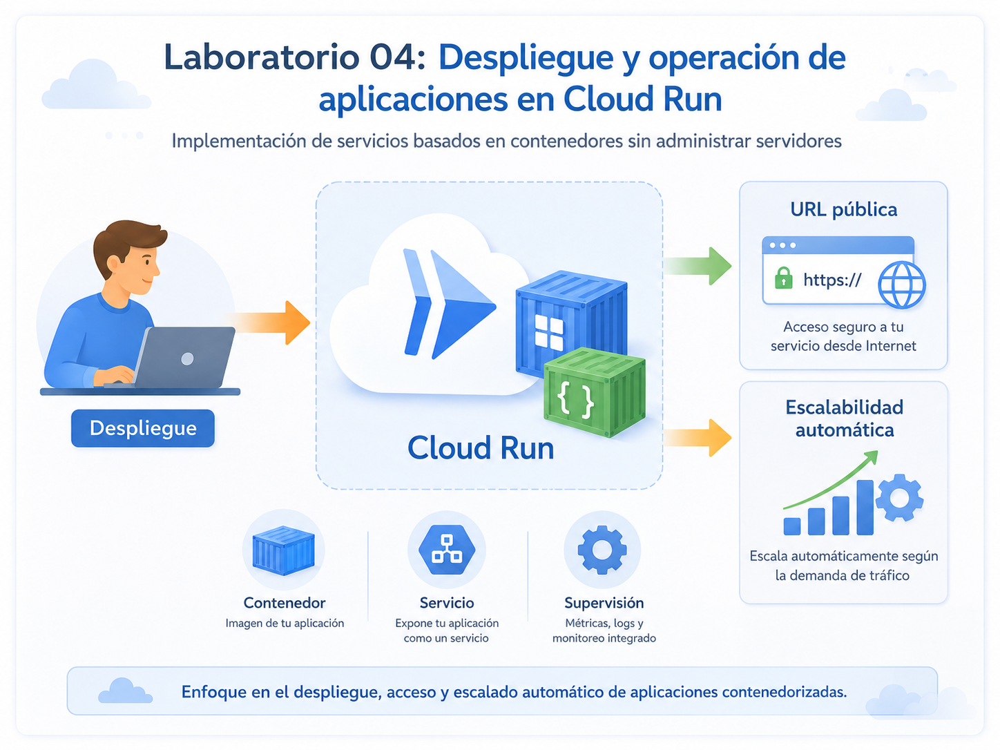

---

## Duración aproximada

**25 minutos**

---

## Tabla de ayuda

| Elemento | Descripción |
|---|---|
| Plataforma | Google Cloud Platform |
| Navegador | Google Chrome (recomendado) |
| Servicio principal | Cloud Run |
| Tipo de servicio | Serverless |
| Recurso desplegado | Servicio web en contenedor |
| Imagen de contenedor | `us-docker.pkg.dev/cloudrun/container/hello:latest` |
| Región | `us-central1` |
| Acceso | Público |
| Proyecto | Proyecto activo de Google Cloud |

> **Nota sobre costos:** Cloud Run cobra principalmente cuando el servicio procesa solicitudes. Para reducir el riesgo de cargos, utiliza la configuración predeterminada, no configures instancias mínimas y elimina el servicio al finalizar.

---

## Instrucciones

---

### Tarea 1. Comprender Cloud Run y serverless computing

Antes de desplegar la aplicación, es importante comprender el concepto principal de este módulo.

#### ¿Sabías que…?

**Concepto: ¿Qué es Cloud Run?**

Cloud Run es un servicio administrado de Google Cloud que permite ejecutar aplicaciones empaquetadas en contenedores sin administrar servidores directamente.

El desarrollador proporciona la aplicación y Cloud Run administra:

- La infraestructura.
- El aprovisionamiento de servidores.
- El escalamiento.
- La disponibilidad del servicio.
- La ejecución del contenedor.
- La asignación de una dirección web.

Cloud Run puede aumentar o reducir automáticamente la cantidad de instancias según las solicitudes recibidas.

---

#### ¿Sabías que…?

**Concepto: Serverless computing**

Serverless computing no significa que no existan servidores.

Significa que el proveedor de nube administra los servidores y la infraestructura subyacente.

El usuario se concentra principalmente en:

- La aplicación.
- El código.
- El contenedor.
- La configuración.
- Los datos.
- Los permisos de acceso.

---

### Tarea 2. Acceder a Google Cloud Run

Paso 1. Acceder a:

https://console.cloud.google.com

Paso 2. Iniciar sesión con una cuenta de Google válida.

Paso 3. Verificar que exista un **proyecto activo** en la parte superior de la consola.

Paso 4. En la barra de búsqueda, escribir:

**Cloud Run**

Paso 5. Seleccionar el servicio **Cloud Run**.


Paso 6. Si aparece una solicitud para habilitar la API de Cloud Run, hacer clic en **Enable**.

> La habilitación puede tardar algunos minutos.

---

#### ¿Sabías que…?

**Concepto: Cloud Run Admin API**

La API de Cloud Run permite crear, configurar, desplegar y eliminar servicios desde un proyecto de Google Cloud.

Muchos servicios de Google Cloud deben habilitarse antes de utilizarlos por primera vez.

---

### Tarea 3. Iniciar el despliegue de la aplicación

En esta tarea desplegarás una aplicación web utilizando una imagen de contenedor previamente construida.

Paso 1. En la página principal de Cloud Run, hacer clic en:

**Deploy container**

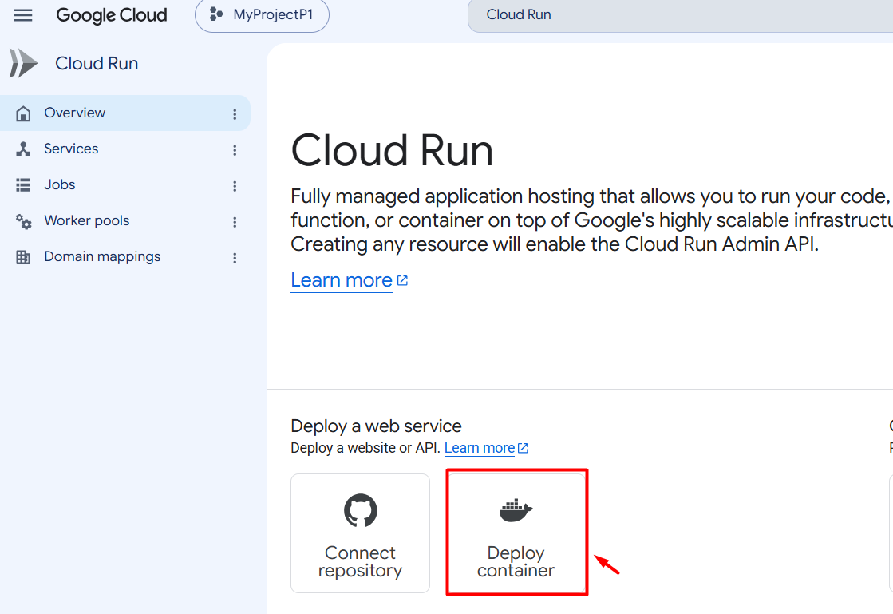

Paso 2. Seleccionar la opción:

**Deploy one revision from an existing container image**

Paso 3. En el campo de imagen del contenedor, escribir:

```text
us-docker.pkg.dev/cloudrun/container/hello:latest
```

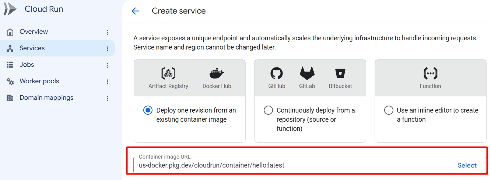

Paso 4. En el campo **Service name**, escribir:

```text
servicio-cloud-run
```

Paso 5. En el campo **Region**, seleccionar:

```text
europe-west1
```
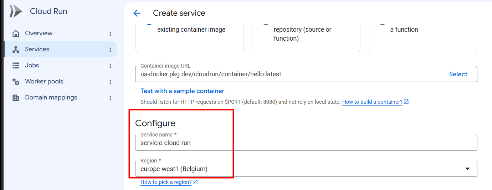

---

#### ¿Sabías que…?

**Concepto: Imagen de contenedor**

Una imagen de contenedor es un paquete que incluye:

- La aplicación.
- Las dependencias.
- Las bibliotecas.
- La configuración necesaria para ejecutarse.

Cloud Run utiliza esa imagen para crear una o más instancias del servicio.

La misma imagen puede ejecutarse de manera consistente en diferentes entornos compatibles con contenedores.

---

### Tarea 4. Configurar el acceso al servicio

En esta tarea permitirás que la aplicación pueda abrirse desde un navegador.

Paso 1. Localizar la sección **Authentication**.

Paso 2. Seleccionar:

**Allow public access**

Esto permite acceder a la aplicación sin iniciar sesión.

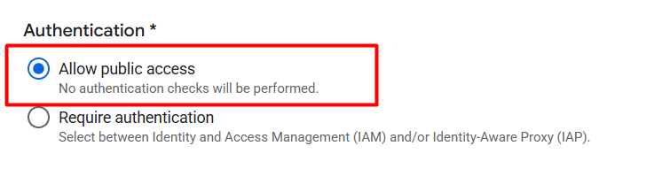

Paso 3. Mantener la configuración predeterminada de escalamiento.

Paso 4. Verificar que la cantidad mínima de instancias permanezca en:

```text
0
```
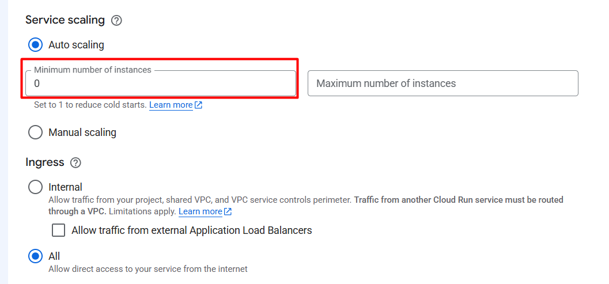
Paso 5. No modificar las opciones avanzadas de:

- CPU.
- Memoria.
- Variables de entorno.
- Redes.
- Seguridad.
- Volúmenes.
- Tiempo de espera.
- Concurrencia.

> **Nota:** Algunas organizaciones bloquean el acceso público mediante políticas. Si la opción no está disponible, el instructor debe utilizar un proyecto que permita servicios públicos o realizar la prueba con autenticación.

---

#### ¿Sabías que…?

**Concepto: Acceso público**

Un servicio público puede recibir solicitudes sin que el usuario proporcione credenciales.

Esto es útil para:

- Sitios web públicos.
- APIs públicas.
- Páginas informativas.
- Aplicaciones abiertas a clientes.

Para servicios empresariales o información sensible, es recomendable requerir autenticación.

---

### Tarea 5. Desplegar el servicio

Paso 1. Revisar la configuración.

Debe contener:

| Configuración | Valor |
|---|---|
| Imagen | `us-docker.pkg.dev/cloudrun/container/hello:latest` |
| Nombre | `servicio-cloud-run` |
| Región | `us-central1` |
| Acceso | Público |
| Instancias mínimas | 0 |

Paso 2. Hacer clic en:
**Create**

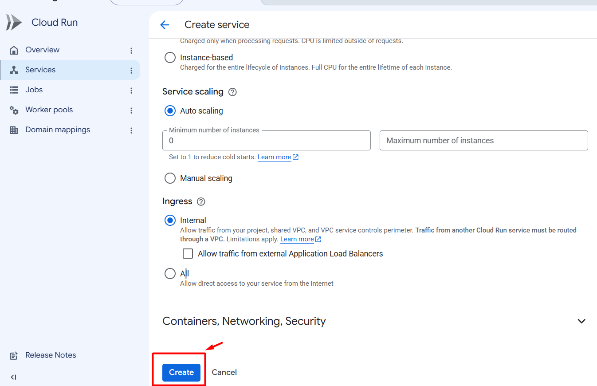


Paso 3. Esperar a que finalice el despliegue.

El proceso puede tardar algunos minutos.

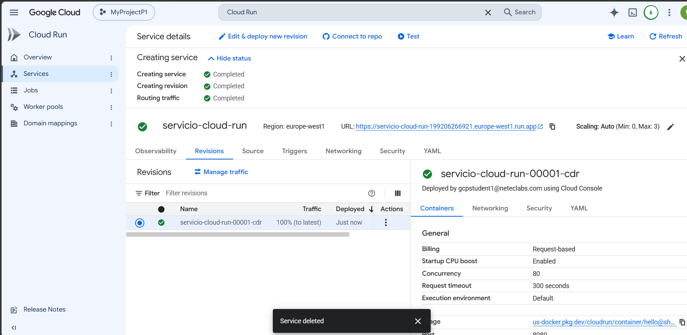

Paso 4. Verificar que el servicio muestre un indicador de implementación correcta.

Paso 5. Localizar la URL asignada automáticamente por Cloud Run.


### Tarea 6. Abrir la aplicación web
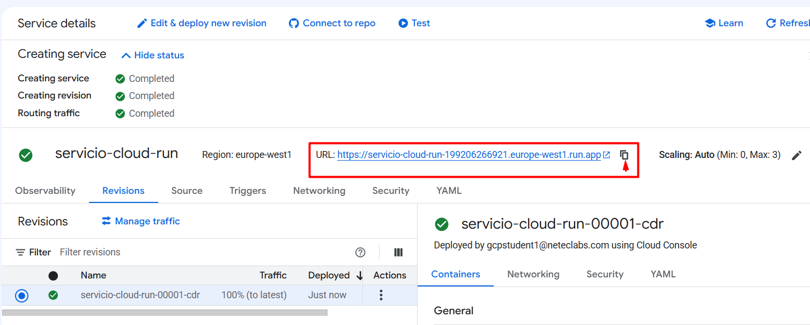

Paso 1. Hacer clic en la URL proporcionada por Cloud Run.

Paso 2. Esperar a que se abra una nueva pestaña.

Paso 3. Verificar que aparezca la aplicación de ejemplo.

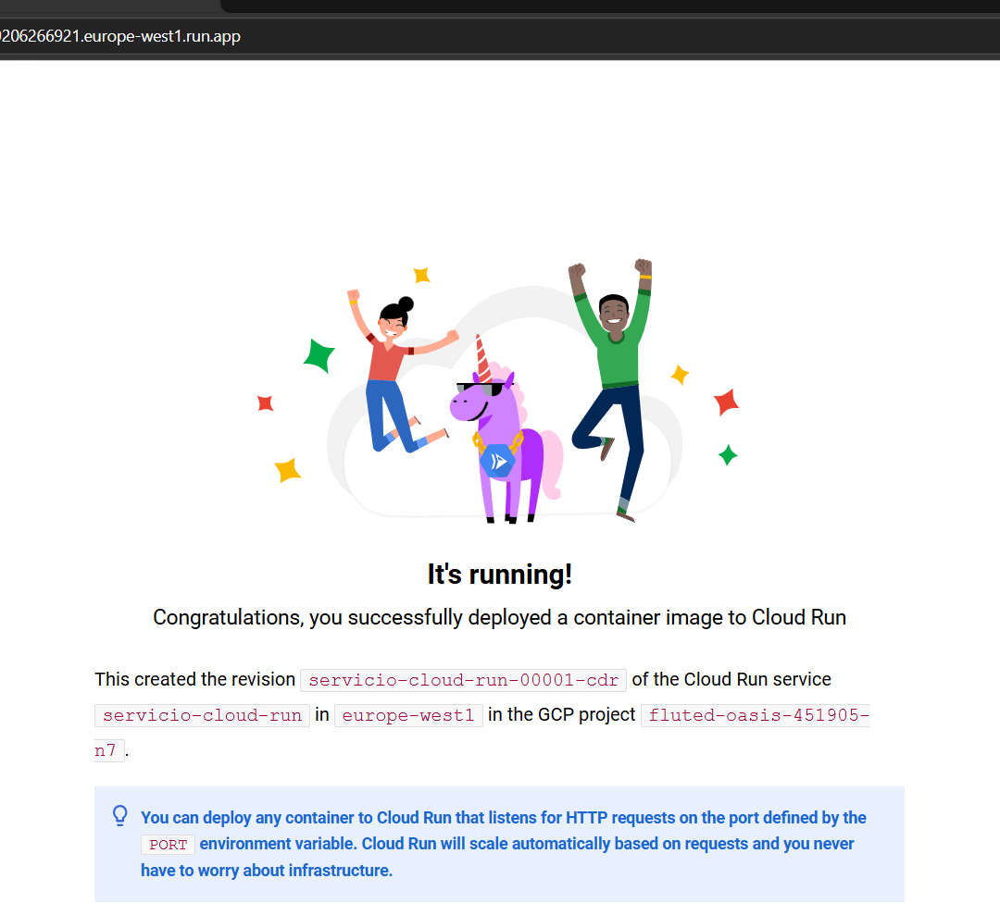
---

Paso 4. Actualizar la página varias veces.

Paso 5. Confirmar que la aplicación continúa respondiendo.

---

## Resultado esperado

La aplicación debe:

- Abrirse desde la URL generada.
- Mostrar el contenido del contenedor.
- Responder sin necesidad de administrar una máquina virtual.
- Permanecer disponible mientras el servicio exista.

---

#### ¿Sabías que…?

**Concepto: URL administrada**

Cloud Run asigna automáticamente una URL segura al servicio.

La comunicación utiliza HTTPS, lo que ayuda a proteger los datos durante la transmisión.

No es necesario configurar manualmente:

- Un servidor web.
- Una dirección IP.
- Un certificado TLS.
- Un balanceador de carga básico.

---

### Tarea 7. Identificar los elementos del servicio

En esta tarea revisarás la información principal del servicio desplegado.

Paso 1. Regresar a la página del servicio en Cloud Run.

Paso 2. Identificar los siguientes elementos:

- Nombre del servicio.
- Región.
- URL.
- Estado.
- Revisión activa.
- Imagen del contenedor.
- Configuración de autenticación.
- Porcentaje de tráfico.
- Número de instancias.


---


### Tarea 8. Comprender el escalamiento automático

Cloud Run puede crear instancias cuando recibe solicitudes y reducirlas cuando la demanda disminuye.

En este laboratorio, la cantidad mínima de instancias se mantiene en cero.

Esto significa que:

- El servicio puede reducirse a cero instancias cuando no recibe solicitudes.
- Cloud Run inicia una instancia cuando llega una nueva solicitud.
- No es necesario mantener un servidor encendido permanentemente.
- El consumo se ajusta a la demanda.

---

#### ¿Sabías que…?

**Concepto: Escalamiento a cero**

El escalamiento a cero permite que un servicio deje de utilizar instancias cuando no recibe tráfico.

Cuando llega una solicitud nueva, Cloud Run inicia automáticamente una instancia para procesarla.

La primera solicitud después de un periodo sin actividad puede tardar un poco más. Este comportamiento se conoce como **cold start**.

---

### Tarea 9. Revisar las revisiones del servicio

Cada vez que se cambia la configuración o la imagen de un servicio, Cloud Run crea una nueva revisión.

Paso 1. Dentro del servicio, localizar la sección **Revisions**.

Paso 2. Identificar la revisión activa.

Paso 3. Verificar que la revisión recibe el 100 % del tráfico.

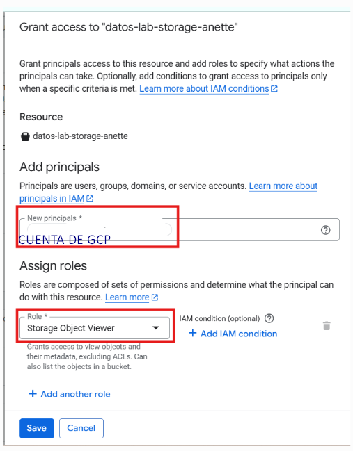

---

#### ¿Sabías que…?

**Concepto: Revisión**

Una revisión es una versión inmutable de la configuración y del contenedor de un servicio de Cloud Run.

Las revisiones permiten:

- Mantener versiones anteriores.
- Distribuir tráfico entre versiones.
- Realizar despliegues graduales.
- Regresar a una versión anterior.
- Probar cambios sin reemplazar inmediatamente todo el servicio.

---

### Tarea 10. Comprender la responsabilidad compartida

En Cloud Run, Google Cloud administra:

- Centros de datos.
- Hardware.
- Red física.
- Sistema operativo subyacente.
- Plataforma de ejecución.
- Escalamiento.
- Balanceo de tráfico.
- Certificados HTTPS administrados.
- Disponibilidad de la infraestructura.

El cliente administra:

- Código de la aplicación.
- Imagen del contenedor.
- Dependencias incluidas.
- Configuración del servicio.
- Identidades y permisos.
- Datos.
- Acceso público o privado.
- Seguridad de la aplicación.

#### Idea clave

> Cloud Run reduce la carga operativa porque Google administra la infraestructura y la plataforma de ejecución, mientras que el cliente se concentra en la aplicación.

---

### Tarea 11. Eliminar el servicio

En esta tarea eliminarás el servicio creado durante el laboratorio.

Paso 1. Regresar a la lista de servicios de Cloud Run.

Paso 2. Seleccionar el servicio:

```text
servicio-cloud-run
```

Paso 3. Hacer clic en:

**Delete**

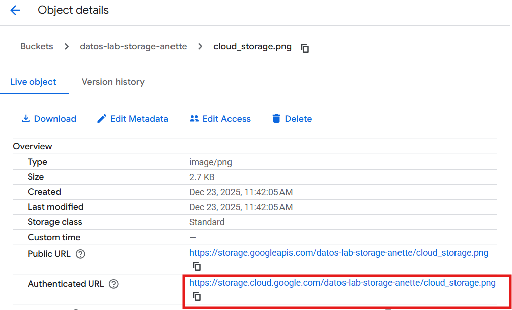

Paso 4. Confirmar la eliminación.

Paso 5. Esperar hasta que el servicio desaparezca de la lista.

> Al eliminar un servicio, también se eliminan sus revisiones. La imagen original del contenedor no se elimina porque pertenece a un repositorio externo administrado por Google.

---

## Resultado esperado

Al finalizar el laboratorio:

- Se desplegó una aplicación web en Cloud Run.
- Se utilizó una imagen de contenedor existente.
- Se configuró una región.
- Se permitió el acceso público.
- Se obtuvo una URL HTTPS.
- Se abrió y probó la aplicación.
- Se identificó el escalamiento automático.
- Se comprendió el concepto de revisión.
- Se eliminó el servicio creado.

---

#### ¿Sabías que…?

Cloud Run no requiere que el usuario administre servidores directamente.

Sin embargo, antes de finalizar una práctica es recomendable:

- Eliminar los servicios que ya no se necesitan.
- Revisar si existen revisiones activas.
- Verificar otros recursos creados.
- Consultar Billing para comprobar el consumo.
- Evitar configurar instancias mínimas en laboratorios básicos.

---

## Conclusiones

En este laboratorio aprendiste a desplegar una aplicación web utilizando Google Cloud Run.

Puntos clave:

- Cloud Run ejecuta aplicaciones empaquetadas en contenedores.
- No es necesario administrar máquinas virtuales.
- Google Cloud administra la infraestructura y el escalamiento.
- El servicio puede escalar automáticamente según la demanda.
- El escalamiento a cero ayuda a reducir el consumo cuando no existe tráfico.
- Cloud Run asigna automáticamente una URL HTTPS.
- El acceso puede configurarse como público o autenticado.
- Cada cambio en el servicio genera una nueva revisión.
- El cliente sigue siendo responsable de la aplicación, los datos y los permisos.
- Eliminar los recursos al finalizar ayuda a evitar cargos innecesarios.

Cloud Run es adecuado para organizaciones que desean modernizar aplicaciones y desplegar servicios web sin administrar directamente servidores o sistemas operativos.

### Fin del laboratorio 4