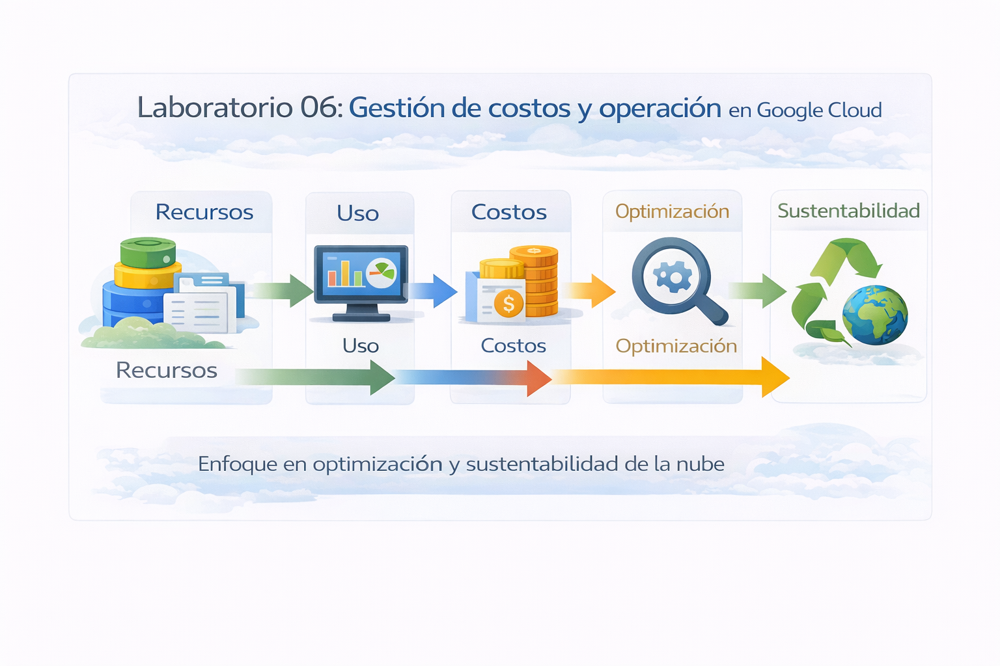

# Laboratorio 06: Gestión de costos, operación y sustentabilidad en Google Cloud

## Objetivo de la práctica
Al finalizar la práctica, serás capaz de:
- Comprender cómo se gestionan los costos en Google Cloud.
- Identificar el consumo de recursos por servicio y proyecto.
- Analizar el impacto financiero de las decisiones técnicas.
- Conocer los principios de excelencia operativa en la nube.
- Relacionar el uso eficiente de recursos con la sustentabilidad.

---

## Objetivo visual
Representar el flujo de consumo y control en la nube:

**Recursos → Uso → Costos → Optimización → Sustentabilidad**

---

## Duración aproximada
**40 minutos**

---

## Tabla de ayuda

| Elemento | Descripción |
|--------|------------|
| Plataforma | Google Cloud Platform |
| Navegador | Google Chrome (recomendado) |
| Servicios principales | Billing, Cost Management |
| Enfoque | Operación y costos |
| Proyecto | Proyecto activo de Google Cloud |

---

## Instrucciones

---

### Tarea 1. Comprender la gestión de costos en la nube

Antes de revisar números, es importante entender cómo funciona el modelo financiero.

#### ¿Sabías que…?
**Concepto: Modelo de pago por uso**

En Google Cloud:
- No se compran servidores.
- No se paga por capacidad máxima.
- Se paga únicamente por los recursos consumidos.

Este modelo permite:
- Escalar sin inversión inicial.
- Optimizar costos según la demanda real.
- Alinear tecnología con el negocio.

---

### Tarea 2. Acceder a la cuenta de facturación (Billing)

Paso 1. Acceder a https://console.cloud.google.com.  

Paso 2. Verificar que exista un **proyecto activo**.  

Paso 3. En la barra de búsqueda, escribir **Billing** y seleccionarlo.

Paso 4. Seleccionar la **cuenta de facturación** asociada al proyecto.

---

#### ¿Sabías que…?
**Concepto: Cuenta de facturación**

Una cuenta de facturación puede:
- Financiar uno o varios proyectos.
- Centralizar el control de costos.
- Separar ambientes (producción, pruebas, laboratorio).

---

### Tarea 3. Analizar el consumo por servicio

En esta tarea revisarás cómo se distribuyen los costos.

Paso 1. Dentro de Billing, ir a la sección **Reports**.

Paso 2. En el panel de reportes:
- Seleccionar **Group by: Service**
- Mantener el rango de fechas por defecto.

Paso 3. Identificar los servicios que generan mayor consumo:
- Compute Engine
- Cloud Storage
- Otros servicios activos

---

#### ¿Sabías que…?
**Concepto: Análisis por servicio**

Agrupar costos por servicio permite:
- Detectar recursos sobredimensionados.
- Identificar oportunidades de optimización.
- Tomar decisiones técnicas con impacto financiero.

---

### Tarea 4. Analizar costos por proyecto

En esta tarea revisarás el consumo a nivel proyecto.

Paso 1. En **Reports**, cambiar:
- **Group by: Project**

Paso 2. Observar el consumo asociado al proyecto activo.

Paso 3. Analizar cómo un solo proyecto puede generar costos si:
- Tiene recursos activos
- No se eliminan entornos de prueba
- No se controla el uso

---

#### ¿Sabías que…?
**Concepto: Gobernanza financiera**

La gobernanza financiera busca:
- Controlar gastos
- Asignar costos correctamente
- Evitar desperdicio de recursos

Es una práctica clave de la excelencia operativa.

---

### Tarea 5. Comprender la excelencia operativa

En esta tarea relacionarás costos y operación.

Paso 1. Reflexionar sobre las siguientes prácticas:
- Apagar recursos no utilizados
- Usar tamaños adecuados de máquinas
- Eliminar entornos temporales

Paso 2. Identificar cómo estas acciones:
- Reducen costos
- Mejoran eficiencia
- Simplifican la operación

---

#### ¿Sabías que…?
**Concepto: Excelencia operativa**

La excelencia operativa consiste en:
- Operar sistemas de forma eficiente
- Reducir errores humanos
- Optimizar continuamente procesos y recursos

No es solo técnico, también es organizacional.

---

### Tarea 6. Relacionar operación eficiente y sustentabilidad

En esta tarea entenderás el impacto ambiental de la nube.

Paso 1. Analizar cómo:
- Menos recursos = menos consumo energético
- Optimización = menor huella de carbono

Paso 2. Comprender que Google Cloud:
- Usa infraestructura energéticamente eficiente
- Opera con energía limpia
- Optimiza recursos automáticamente

---

#### ¿Sabías que…?
**Concepto: Sustentabilidad en la nube**

La sustentabilidad en Google Cloud se logra mediante:
- Centros de datos eficientes
- Uso responsable de recursos
- Optimización automática de cargas

Usar bien la nube también es una decisión ambiental.

---

## Resultado esperado
- Comprensión clara del modelo de costos.
- Identificación del consumo por servicio y proyecto.
- Relación entre decisiones técnicas y gasto.
- Visión integral de operación y sustentabilidad.

---

## Conclusiones

En este laboratorio aprendiste que operar en la nube implica más que crear recursos.

Puntos clave:
- Google Cloud utiliza un modelo de pago por uso.
- El control de costos es responsabilidad del cliente.
- La excelencia operativa reduce gastos y errores.
- Optimizar recursos mejora eficiencia y sustentabilidad.
- Las decisiones técnicas tienen impacto financiero y ambiental.

La nube permite escalar rápidamente, pero solo una **operación consciente y responsable** garantiza valor real para el negocio y el entorno.

Operar bien en la nube es:
**eficiencia + control + sostenibilidad**.

### Fin del laboratorio 6